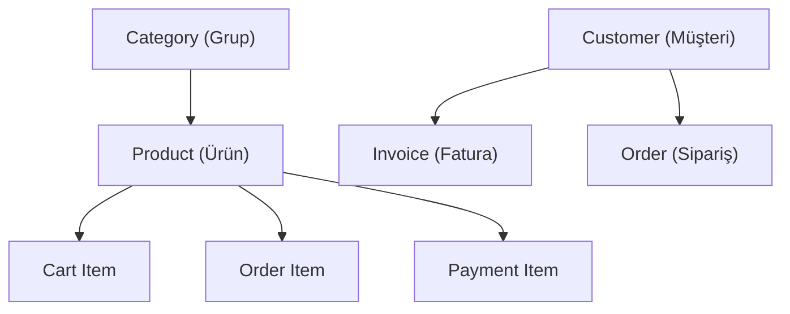

# Database Overview & Hierarchy

This document provides a summary of the database structure for the Regkasse (Austria POS) project. It is designed to help developers understand how data is organized and related.

## 1. Core Entity Hierarchy

The system follows a standard retail/POS data structure at its core:

- **Category**: Product groups (e.g., Food, Drinks).
- **Product**: Master data for items being sold (Price, TaxRate, Stock).
- **Customer**: Registered clients for loyalty or B2B invoicing.

## 2. Transactional Flow

The lifecycle of a sale typically follows this path:

1.  **Cart**: Active selection of items on the POS screen.
2.  **Order / TableOrder**: Finalized selection (especially for restaurant/table use).
3.  **Invoice / PaymentDetails**: The technical record of a successful transaction.
4.  **GeneratedReceipt / Receipt**: The final document provided to the customer.

## 3. Compliance Layer (RKSV / Austria)

Since this is an Austrian Cash Register system, compliance data is strictly managed:

- **TseDevice & TseSignature**: Logs of hardware/software security signatures.
- **DailyClosing**: Aggregated daily reports (Tagesabschluss) required by law.
- **FinanzOnlineError**: Logs of failed synchronization with Austrian tax authorities.
- **AuditLog**: Immutable record of system changes for auditing purposes.

## 4. System & Settings

- **CompanySettings**: Legal entity information (Tax ID, Address).
- **SystemSettings**: Technical configurations (Backup habits, SMS/Email).
- **LocalizationSettings**: Multi-language and currency support support.
- **UserSettings**: Individual POS user preferences (Language, Theme, CashRegister ID).

## 5. Technical Constraints

> [!IMPORTANT]
> **Money Logic**: Always use `decimal(18,2)` for financial values. Never perform rounding in the database; business logic handles precision.

- **Storage**: PostgreSQL is the primary store.
- **Flexible Fields**: Extensive use of `jsonb` for dynamic data (e.g., `AuditLog.OldValues`, `ReceiptTemplate.CustomFields`).
- **IDs**: 
    - Most transactional IDs (Order, Cart) are `max 50` strings/GUIDs for distributed compatibility.
    - Security/User IDs follow ASP.NET Identity (max 450).
- **Delete Behavior**: `Cascade` is common for Cart -> Items, but `Restrict` or `SetNull` is used for Master Data (Product/Category) to maintain historical integrity.
