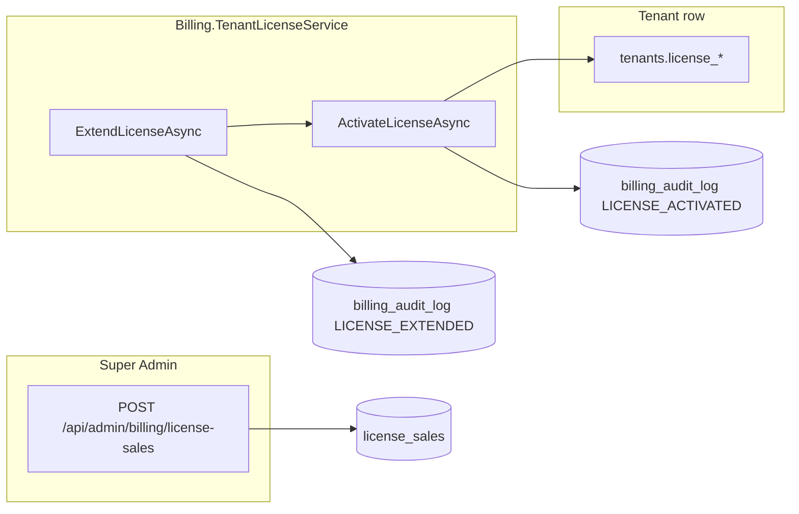

# Billing tenant license (Mandanten-SaaS)

> **Scope:** Super Admin license sales (`license_sales`) and Manager self-service activation/extension via billing-format keys.  
> **Not in scope:** Deployment / On-Premise license (`LicenseService`, `issued_licenses`, `activated_licenses`) — see [`LICENSE_SYSTEM.md`](LICENSE_SYSTEM.md).

**Last updated:** 2026-06-24 (billing test suite reorganized under `Tests/Billing/`)

---

## Three license layers (do not conflate)

| Layer | German (operator) | Storage | Key format | Primary API |
|-------|---------------------|---------|------------|-------------|
| **Deployment** | Server-Lizenz (On-Premise) | Encrypted file + `activated_licenses` | `REGK-XXXXX-XXXXX-XXXXX` + JWT | `/api/admin/license/*`, `POST /api/license/activate` (deployment branch) |
| **Mandant row** | Mandantenlizenz (SaaS) | `tenants.license_key`, `tenants.license_valid_until_utc`, `tenants.current_license_sale_id` | Any applied key | `GET /api/tenants/switcher`, `/api/admin/tenants/{id}/license/*` |
| **Billing sale** | Lizenzverkauf (Super Admin) | `license_sales`, `billing_audit_log`, `license_reminders` | `REGK-{yyyyMMdd}-{tenantSlug}-{8chars}` | `/api/admin/billing/*`, billing branch of license lifecycle |



---

## Billing license key format

Generated by `ILicenseKeyGenerator` (`LicenseKeyGenerator.cs`):

```text
REGK-{yyyyMMdd}-{tenantSlug}-{8 alphanumeric}
```

Example: `REGK-20270101-cafe-A7F3K2D9`

`POST /api/license/activate` routes keys that pass `ValidateLicenseKeyFormat` to **billing** activation; deployment keys use the legacy `ILicenseService.ActivateAsync` path.

---

## Backend services

| Type | Namespace | Role |
|------|-----------|------|
| `IBillingService` / `BillingService` | `Services.Billing` | Super Admin: preview/create/list license sales, invoices |
| `IBillingAuditService` / `BillingAuditService` | `Services.Billing` | Append/list `billing_audit_log` (actor via `ICurrentUserService`) |
| `IReminderService` / `ReminderService` | `Services.Billing` | Schedule/query/send license expiry reminders (`license_reminders`); also `IBillingReminderService` |
| `BillingReminderHostedService` | `Services.Hosted` | Background daily sweep (check + send pending reminders) |
| `ITenantLicenseService` / `TenantLicenseService` | `Services.Billing` | Mandant lifecycle: status, activate, extend, expiring list, history |
| `ITenantLicenseService` / `TenantLicenseService` | `Services.AdminTenants` | Read-only: key preview, resolve billing sale for **legacy** mandant extend |
| `IAdminTenantLicenseService` | `Services.AdminTenants` | Super Admin + legacy Manager mandant overview/extend (`AdminTenantLicenseService`) |
| `ICurrentUserService` / `CurrentUserService` | `Services` | Resolves authenticated actor user id for billing audit |

**DI** (`ApplicationHost.cs`):

```csharp
builder.Services.AddScoped<IBillingService, BillingService>();
builder.Services.AddScoped<IBillingTenantLicenseService, BillingTenantLicenseService>();
builder.Services.AddScoped<ICurrentUserService, CurrentUserService>();
builder.Services.AddScoped<IBillingAuditService, BillingAuditService>();
builder.Services.AddScoped<IReminderService, ReminderService>();
builder.Services.AddScoped<IBillingReminderService>(sp => (IBillingReminderService)sp.GetRequiredService<IReminderService>());
builder.Services.AddHostedService<BillingReminderHostedService>();
builder.Services.AddScoped<IAdminTenantLicenseKeyService, AdminTenantLicenseKeyService>();
builder.Services.AddScoped<IAdminTenantLicenseService, AdminTenantLicenseService>();
```

`BillingService` resolves `IBillingReminderService` via `IServiceScopeFactory` after commit (avoids circular DI with `ReminderService` → `TenantLicenseService` → `BillingService`).

Controllers use aliases (`IBillingTenantLicenseService`, `IAdminTenantLicenseKeyService`) to avoid the duplicate interface name.

`Billing.TenantLicenseService` uses `IDbContextFactory<AppDbContext>` (not scoped `AppDbContext` injection).

---

## API endpoints

### Super Admin — billing sales

| Method | Path | Auth | Description |
|--------|------|------|-------------|
| `POST` | `/api/admin/billing/license-sales/preview` | `SuperAdmin` | Price + generated key preview |
| `POST` | `/api/admin/billing/license-sales` | `SuperAdmin` | Persist sale; updates tenant mandant fields |
| `GET` | `/api/admin/billing/license-sales` | `SuperAdmin` | List/filter sales |
| `GET` | `/api/admin/billing/license-sales/{id}` | `SuperAdmin` | Sale detail |
| `GET` | `/api/admin/billing/license-sales/by-key/{licenseKey}` | `SuperAdmin` | Lookup by billing key |
| `GET` | `/api/admin/billing/license-sales/{id}/pdf` | `SuperAdmin` | Download invoice PDF |
| `POST` | `/api/admin/billing/license-sales/preview-pdf` | `SuperAdmin` | Preview PDF without persisting |
| `POST` | `/api/admin/billing/license-sales/{id}/cancel` | `SuperAdmin` | Cancel sale; cancels pending reminders |
| `GET` | `/api/admin/billing/stats` | `SuperAdmin` | Revenue / sale statistics |
| `GET` | `/api/admin/billing/license-sales/expiring` | `SuperAdmin` | Licenses expiring within threshold |
| `GET` | `/api/admin/billing/tenants/{tenantId}/license` | `SuperAdmin` | Mandant license info |

### Super Admin — billing audit

| Method | Path | Auth | Description |
|--------|------|------|-------------|
| `GET` | `/api/admin/billing/audit` | `SuperAdmin` | Paginated audit log (`tenantId`, `saleId`, `action`, dates, `userId`) |
| `GET` | `/api/admin/billing/license-sales/{id}/audit` | `SuperAdmin` | Audit trail for one sale |

### Super Admin — billing reminders

| Method | Path | Auth | Description |
|--------|------|------|-------------|
| `GET` | `/api/admin/billing/tenants/{tenantId}/reminders` | `SuperAdmin` | Reminder rows for tenant |
| `POST` | `/api/admin/billing/reminders/check` | `SuperAdmin` | Manual: create missing reminders for expiring licenses |
| `POST` | `/api/admin/billing/reminders/send` | `SuperAdmin` | Manual: process pending reminders |

Controller: `AdminBillingController` (`[Authorize(Roles = SuperAdmin)]`).

### Manager — billing extend (canonical, 2026-06)

| Method | Path | Permission | Body | Response |
|--------|------|------------|------|----------|
| `POST` | `/api/admin/license/extend` | `settings.manage` | `{ "licenseKey": "REGK-…" }` | `{ success, message, licenseKey, validUntil, plan }` |

Controller: `AdminLicenseController.Extend.cs` → `Billing.ITenantLicenseService.ExtendLicenseAsync`.

Requires JWT tenant context (`ICurrentTenantAccessor`) and authenticated actor user id.

### Legacy Manager mandant paths (still active)

| Method | Path | Permission | Service |
|--------|------|------------|---------|
| `GET` | `/api/admin/license/mandant` | `license.manage` | `AdminTenantLicenseService.GetOverviewAsync` |
| `POST` | `/api/admin/license/mandant/preview` | `license.manage` | `AdminTenants.TenantLicenseService` resolve |
| `POST` | `/api/admin/license/mandant/extend` | `license.manage` | `AdminTenantLicenseService.ExtendAsync` |

**FA today:** `frontend-admin/src/features/license/api/tenantLicense.ts` still calls **`/api/admin/license/mandant/extend`**. New billing extend should migrate to **`/api/admin/license/extend`** when product confirms permission (`settings.manage` vs `license.manage`).

### Super Admin — tenant license tab

| Method | Path | Auth |
|--------|------|------|
| `GET` | `/api/admin/tenants/{tenantId}/license` | `SuperAdmin` |
| `PUT` | `/api/admin/tenants/{tenantId}/license` | `SuperAdmin` |
| `POST` | `/api/admin/tenants/{tenantId}/license/extend` | `SuperAdmin` (+ rate limiter) |

Uses `IAdminTenantLicenseService`; billing keys resolved via `AdminTenants.TenantLicenseService.ResolveBillingLicenseSaleForKeyAsync`.

### Anonymous / shared activation

| Method | Path | Billing branch |
|--------|------|----------------|
| `POST` | `/api/license/activate` | If key matches billing format → `Billing.TenantLicenseService.ActivateLicenseAsync` (requires tenant context + authenticated user for billing keys) |

---

## Extend semantics

`ExtendLicenseAsync` (billing):

1. Calls `ActivateLicenseAsync` (same validations: format, sale exists, active status, not expired, tenant match).
2. Writes `license_sales.last_extended_at_utc`, `extended_by_user_id`.
3. Appends `billing_audit_log` with action `LICENSE_EXTENDED`.

**Important:** Extend does **not** add days to the current expiry. The Manager must supply a **new** billing key from a sale whose `valid_until_utc` is later than the current mandant expiry (product rule — not yet enforced in code).

German success message: *„Lizenz wurde erfolgreich verlängert.“*

---

## Validation rules (`Billing.TenantLicenseService`)

| Check | Error (DE, representative) |
|-------|----------------------------|
| Invalid key format | *Ungültiges Lizenzformat…* |
| Sale not found | *Lizenzschlüssel nicht gefunden…* |
| Sale cancelled / inactive | *storniert* / *nicht mehr gültig* |
| `valid_until_utc` ≤ now | *bereits abgelaufen* |
| Key slug ≠ tenant slug (wrong tenant) | *anderen Mandanten* |
| Missing tenant context (API layer) | *Tenant context required.* |

**Not yet enforced (roadmap):**

- New `validUntil` must be **greater than** current tenant expiry (no downgrade).
- Rate limiting on `POST /api/admin/license/extend` (exists on Super Admin tenant extend via `ITenantLicenseExtensionRateLimiter`).
- `ILicenseSync.SyncTenantLicenseExpiryAsync` after billing extend (legacy mandant extend calls this).
- Idempotency / reject re-extend with the same already-active key.

---

## Audit

| Action | Table | Constant | Trigger |
|--------|-------|----------|---------|
| Sale created | `billing_audit_log` | `SALE_CREATED` | `BillingService.CreateLicenseSaleAsync` |
| Sale cancelled | `billing_audit_log` | `SALE_CANCELLED` | `BillingService.CancelLicenseSaleAsync` |
| Activation | `billing_audit_log` | `LICENSE_ACTIVATED` | `TenantLicenseService.ActivateLicenseAsync` |
| Extension | `billing_audit_log` | `LICENSE_EXTENDED` | `TenantLicenseService.ExtendLicenseAsync` |
| Refund (planned) | `billing_audit_log` | `SALE_REFUNDED` | Not wired yet |

Query API: `GET /api/admin/billing/audit`, `GET /api/admin/billing/license-sales/{id}/audit`.

Legacy mandant extend also writes security `AuditLog` via `AdminTenantLicenseService` — both trails may exist during migration.

---

## Reminders (`license_reminders`)

| Status | Meaning |
|--------|---------|
| `pending` | Scheduled, not sent |
| `sent` | Processed (`reminder_sent_at_utc` set) |
| `cancelled` | Sale cancelled or superseded |

**Anchors (days before expiry):** 30, 15, 7, 3, 1 — created on sale (`ScheduleRemindersForSaleAsync`) or daily check (`CheckAndCreateRemindersAsync`).

**Background:** `BillingReminderHostedService` runs every 24h (check + send). Manual override: `POST /api/admin/billing/reminders/check|send`.

**Configuration** (`BillingOptions`, section `Billing` in `appsettings`):

```json
"Billing": {
  "ReminderDaysBeforeExpiry": [30, 15, 7],
  "ReminderCheckHourUtc": 9,
  "ReminderCheckMinuteUtc": 0
}
```

Note: hosted service currently uses a fixed 24h interval; `ReminderCheckHourUtc/MinuteUtc` and config anchors are **partially wired** (roadmap: align code with `BillingOptions`).

**Email:** `SendPendingRemindersAsync` marks rows sent and logs; SMTP via `ILicenseReminderEmailSender` is **not yet integrated** for billing reminders.

---

## Database migrations

Apply from `backend/`:

```bash
dotnet ef database update --project KasseAPI_Final.csproj
```

Relevant billing migrations (2026-06):

| Migration | Tables / changes |
|-----------|------------------|
| `20260622155213_AddLicenseSales` | Initial `license_sales` |
| `20260622160335_AddBillingAuditLog` | `billing_audit_log` (evolved in next migration) |
| `20260622163839_AddLicenseSalesTables` | `license_sales` final shape, `license_reminders`, audit column renames |
| `20260622164032_AddTenantLicenseSaleTracking` | Tenant `current_license_sale_id` etc. |
| `20260622164703_AddLicenseSaleStatusIndexes` | Sale status indexes |
| `20260622170803_AddInvoiceSequenceTable` | `invoice_sequences` |

---

## Frontend Admin

| Feature | File | API (current) |
|---------|------|---------------|
| Manager extend UI | `features/license/` | `POST /api/admin/license/mandant/extend` |
| Super Admin license tab | `features/super-admin/components/LicenseManager.tsx` | `/api/admin/tenants/{id}/license/*` |
| Header mandant badge | `useHeaderTenantLicense` | `GET /api/tenants/switcher` (tenant row fields) |

---

## Tests

Full guide: [`BILLING_TESTING.md`](BILLING_TESTING.md).  
Manual E2E: [`BILLING_E2E_TEST_PLAN.md`](BILLING_E2E_TEST_PLAN.md).

| File | Coverage |
|------|----------|
| `KasseAPI_Final.Tests/Billing/BillingServiceTests.cs` | Sale preview/create/list/cancel/stats/PDF/key validation (38 tests) |
| `KasseAPI_Final.Tests/Billing/BillingServiceTestHarness.cs` | Shared in-memory harness for billing service tests |
| `KasseAPI_Final.Tests/TenantLicenseServiceTests.cs` | Status none, activate valid/expired, expiring list |
| `KasseAPI_Final.Tests/BillingTenantLicenseServiceTests.cs` | Extended service scenarios (wrong tenant, extend metadata, history) |
| `KasseAPI_Final.Tests/LicenseControllerManagerTests.cs` | Manager billing API (`/api/license/billing/*`) |
| `KasseAPI_Final.Tests/AdminLicenseExtendTests.cs` | `POST /api/admin/license/extend` controller |
| `KasseAPI_Final.Tests/LicenseControllerActivateTests.cs` | Billing key branch on `POST /api/license/activate` |
| `KasseAPI_Final.Tests/BillingAuditServiceTests.cs` | Audit log write, list filters, sale trail |
| `KasseAPI_Final.Tests/BillingReminderServiceTests.cs` | Schedule anchors, cancel pending, send pending |
| `KasseAPI_Final.Tests/AdminBillingControllerTests.cs` | Controller integration (sales, PDF) |
| `frontend-admin/src/shared/__tests__/billingRoutes.test.ts` | FA billing routes + permission guards |

```bash
cd backend && dotnet test --filter "FullyQualifiedName~Billing|FullyQualifiedName~TenantLicenseService|FullyQualifiedName~AdminBilling"
cd frontend-admin && npm run test -- src/shared/__tests__/billingRoutes.test.ts
```

---

## Related documentation

| Document | Topic |
|----------|--------|
| [`LICENSE_SYSTEM.md`](LICENSE_SYSTEM.md) | Deployment vs mandant display, FA roles |
| [`TENANT_MANAGEMENT.md`](TENANT_MANAGEMENT.md) | Super Admin tenant license tab |
| [`MULTI_TENANT.md`](MULTI_TENANT.md) | Tenant context, API boundaries |
| [`LICENSE_MANAGEMENT_DESIGN.md`](LICENSE_MANAGEMENT_DESIGN.md) | Deployment JWT / renewal design (separate track) |
| [`ai/modules/billing_license.md`](../ai/modules/billing_license.md) | AI agent guardrails for this module |
