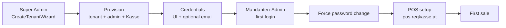

# Customer Onboarding Process

> **Audience:** Super Admin operators, support, Mandanten-Admins, FA maintainers.  
> **UI language (operators):** German (de-AT). **Technical/API:** English.  
> **Related:** [`TENANT_MANAGEMENT.md`](TENANT_MANAGEMENT.md), [`POS_PRODUCTION_ARCHITECTURE.md`](POS_PRODUCTION_ARCHITECTURE.md), [`MULTI_TENANT.md`](MULTI_TENANT.md), [`LICENSE_SYSTEM.md`](LICENSE_SYSTEM.md), [`EMAIL_CONFIGURATION.md`](EMAIL_CONFIGURATION.md), [`USER_MANAGEMENT.md`](USER_MANAGEMENT.md).

End-to-end guide from **Super Admin tenant creation** through **Mandanten-Admin first login**, **POS setup**, and **first sale**.

---

## Process flow (overview)

```text
SuperAdmin → Mandant anlegen (wizard) → Credentials handoff
         → Mandanten-Admin first login (password change)
         → POS setup (shared POS UI)
         → First sale / Testverkauf
```



| Phase | Actor | Where |
|-------|--------|--------|
| Create tenant | Super Admin | `admin.regkasse.at` → `/admin/tenants` or `/admin/tenants/create` |
| Receive credentials | Customer / operator handoff | Welcome email and/or FA result screen |
| First login | Mandanten-Admin (`Manager`) | Admin FA session (tenant-scoped JWT) |
| POS setup | Mandanten-Admin / Kassierer | Shared POS: `https://pos.regkasse.at` |
| First sale | Kassierer / Mandanten-Admin | POS → payment → TSE receipt |

---

## Step 1: Super Admin creates tenant

### Entry

1. Login as **SuperAdmin** on `https://admin.regkasse.at`
2. Open **Mandanten** → `/admin/tenants`
3. Click **Mandant anlegen** → navigates to `/admin/tenants/create`
4. Complete the **5-step** `CreateTenantWizard`
5. Review summary → confirm → wait for processing → copy credentials from the result screen

**UI:** `frontend-admin/src/features/super-admin/components/CreateTenantWizard/`  
**API:** `POST /api/admin/tenants` (Super Admin JWT)  
**Backend:** `TenantOnboardingService.CreateAsync` → DB transaction + `TenantProvisioningService`

### Wizard steps

| Step | UI | What is collected |
|------|-----|-------------------|
| **1. Firma** | `Step1TenantInfo` | Company name, slug (auto from name + live availability), contact email, optional phone/address |
| **2. Administrator** | `Step2AdminUser` | Admin email, password (auto or manual), role fixed **Mandanten-Admin** (`Manager`) |
| **3. Kasse & Lizenz** | `Step3RegisterLicense` | Register name (default `KASSE-001`), license 30/90/365 days + start date, demo products checkbox |
| **4. Zusammenfassung** | `Step4Summary` | Read-only review + irreversible warning |
| **5. Ergebnis** | `Step5Result` | One-time password, login URL, copy / handoff actions |

While create runs, `CreateTenantProcessingView` shows animated provisioning steps (company → slug → admin → license → register → products → credentials).

**Rollback:** If provisioning fails after the tenant row is inserted, the transaction is rolled back (no partial customer). UI: `OnboardingErrorModal` with German rollback note.

### Slug check

- Live: `GET /api/admin/tenants/slug-availability?slug={slug}`
- Conflict suggestions: `GET /api/admin/tenants/slug-suggestions?name=…&slug=…`
- Reserved: `admin`, `www`, `api`, `pos`, …

---

## Step 2: Tenant receives credentials

After success, Super Admin (or SMTP) delivers:

| Item | Source |
|------|--------|
| **Admin email** | Wizard Step 2 / `provisioning.adminEmail` |
| **Temporary password** | Shown **once** on Step 5 (and in welcome email if SMTP works) |
| **Portal / handoff URL** | Built as `https://{slug}.regkasse.at` in FA (`buildTenantPortalUrl`) |
| **Force password change** | `MustChangePasswordOnNextLogin = true` |

### Welcome email (SMTP)

**Service:** `WelcomeEmailService`  
**Trigger:** After successful commit (outside the DB transaction). Email failure does **not** undo the tenant.

| SMTP configured | Result |
|-----------------|--------|
| Yes | Email to contact/admin with URL, email, temporary password, first steps (DE) |
| No / send failed | Onboarding still succeeds; audit `TENANT_ONBOARDING_WELCOME_EMAIL` = Warning; Super Admin must copy credentials from Step 5 |

---

## Step 3: Mandanten-Admin first login

```text
1. Open admin / portal URL from handoff (or https://admin.regkasse.at)
2. Sign in with admin email + temporary password
3. System forces password change (MustChangePasswordOnNextLogin)
4. Land on FA dashboard (tenant-scoped JWT)
5. Check registers under Kassen / tenant overview
6. Optionally open POS for first sale (next step)
```

### Checklist (operator → customer)

- [ ] Customer can open the login URL
- [ ] Temporary password works exactly once for first login
- [ ] Password change succeeds (min length / complexity per Identity policy)
- [ ] Dashboard loads without cross-tenant errors
- [ ] License status looks valid (30/90/365 days as created)
- [ ] Cash register `KASSE-001` (or custom number) is visible

**Role:** Backend role string remains `Manager`; UI label **Mandanten-Admin**.

---

## Step 4: POS setup

Production uses a **single shared POS UI** (not a per-tenant POS host). See [`POS_PRODUCTION_ARCHITECTURE.md`](POS_PRODUCTION_ARCHITECTURE.md).

| Surface | Production URL |
|---------|----------------|
| POS | `https://pos.regkasse.at` |
| Admin FA | `https://admin.regkasse.at` |
| API | `https://api.regkasse.at` |

```text
1. Open https://pos.regkasse.at (or mobile POS app pointing at production API)
2. Login with the same Mandanten-Admin (or cashier) credentials
3. Tenant is resolved from JWT tenant_id after login (not from Host slug)
4. Select cash register KASSE-001 / Hauptkasse
5. Confirm TSE / NTP health as required by fiscal rules
6. Start selling (Testverkauf recommended first)
```

### Development tips

- POS: `http://localhost:8081` with `EXPO_PUBLIC_DEV_TENANT_ID` / DevTenantSwitcher
- API: `http://localhost:5184` with `X-Tenant-Id: {slug}` or `?tenant={slug}` (Development only)

---

## Step 5: First sale (Testverkauf)

Recommended first-day path for the customer:

1. Ensure register is selected and TSE is healthy
2. Add a **demo product** (provisioned on create) to the cart
3. Complete payment → fiscal receipt with TSE signature
4. Verify receipt in FA (reports / payments) if needed
5. Optionally configure printer, additional users, and real product catalog

Do **not** treat demo products as production assortment — replace or deactivate after go-live.

---

## Auto-provisioned assets

Executed inside **one database transaction** (`TenantOnboardingService`); failure → **rollback**.

| Asset | Default | Notes |
|-------|---------|--------|
| Tenant row | `status=active`, `isActive=true` | Slug unique |
| Cash register | `KASSE-001`, *Hauptkasse*, `Closed` | Optional custom number from wizard |
| Category / products | *Allgemein* + 3 demo SKUs, or full demo menu | `importDemoMenu` |
| Admin user | `Manager`, **owner** membership | Password change forced |
| License | 30 / 90 / 365 days from start date | `licenseValidUntilUtc` |

Response `provisioning` (one-time): `adminEmail`, `generatedPassword`, `cashRegisterId`, `cashRegisterNumber`, `productIds[]`, `trialLicenseValidUntilUtc`, `welcomeEmailSent`, `forcePasswordChangeOnNextLogin`.

---

## Troubleshooting

| Symptom | Likely cause | What to do |
|---------|--------------|------------|
| **Slug bereits vergeben** / `slug_taken` | Slug already used | Pick a suggestion from error modal or change slug; live check on Step 1 |
| **Admin-E-Mail bereits vergeben** / `admin_email_taken` | Identity user email collision | Use another admin email |
| **Password too short** | Manual password &lt; 8 chars | Wizard Step 2 validation; server also rejects |
| **Create fails mid-progress** | Provisioning error | Transaction rollback; fix cause and retry — no partial tenant in production DB |
| **No welcome email** | SMTP missing/misconfigured | Copy credentials from Step 5; fix `Email:Smtp` (see [`EMAIL_CONFIGURATION.md`](EMAIL_CONFIGURATION.md)) |
| **Customer cannot login** | Wrong host, typo, or suspended tenant | Confirm URL, email, password; check tenant status on `/admin/tenants` |
| **Password change loop / stuck** | Client not completing force-change flow | Support: verify `MustChangePasswordOnNextLogin`; Super Admin can reset password from tenant users tab |
| **POS shows wrong / no tenant** | Dev header vs production JWT | Production: login only (no `X-Tenant-Id`); Dev: set `EXPO_PUBLIC_DEV_TENANT_ID` |
| **No cash register on POS** | Register not selected / inactive | FA → tenant registers; ensure `KASSE-001` active |
| **Cannot sell (TSE / NTP)** | Fiscal gate | Check TSE health and NTP offset before treating online payments as allowed |
| **License expired immediately** | Wrong start date / duration | Super Admin → tenant **Lizenz** tab; extend or re-issue |

### Structured API error codes

| Code | Meaning |
|------|---------|
| `slug_invalid` | Bad slug format / reserved |
| `slug_taken` | Slug already exists |
| `admin_email_taken` | Admin email in use |
| `provisioning_failed` | User/register/products setup failed |
| `unknown` | Generic failure |

### Audit trail (system)

Per attempt (correlation id):  
`TENANT_ONBOARDING_STARTED` → `TENANT_ONBOARDING_TENANT_CREATED` → `TENANT_ONBOARDING_PROVISIONED` → `TENANT_ONBOARDING_WELCOME_EMAIL` → `TENANT_ONBOARDING_COMPLETED` (or `…_FAILED`).

---

## API example (create)

```bash
curl -X POST "https://admin.regkasse.at/api/admin/tenants" \
  -H "Authorization: Bearer <super-admin-jwt>" \
  -H "Content-Type: application/json" \
  -d '{
    "name": "Cafe Muster GmbH",
    "slug": "cafe-muster",
    "email": "info@cafe-muster.at",
    "adminEmail": "admin@cafe-muster.at",
    "grantTrialLicense": true,
    "licenseValidUntilUtc": "2027-07-17T23:59:59.999Z",
    "importDemoMenu": true,
    "cashRegisterNumber": "KASSE-001"
  }'
```

Slug preview:

```bash
curl -H "Authorization: Bearer <super-admin-jwt>" \
  "https://admin.regkasse.at/api/admin/tenants/slug-availability?slug=cafe-muster"
```

---

## Key files

| Layer | Path |
|-------|------|
| Create route | `frontend-admin/src/app/(protected)/admin/tenants/create/page.tsx` |
| Wizard | `frontend-admin/src/features/super-admin/components/CreateTenantWizard/` |
| Steps | `Step1TenantInfo`, `Step2AdminUser`, `Step3RegisterLicense`, `Step4Summary`, `Step5Result` |
| Progress / errors | `CreateTenantProcessingView`, `OnboardingErrorModal` |
| Backend onboarding | `backend/Services/AdminTenants/TenantOnboardingService.cs` |
| Provisioning | `backend/Services/AdminTenants/TenantProvisioningService.cs` |
| Slug helpers | `backend/Services/AdminTenants/TenantSlugSuggestions.cs` |
| Scenario tests | `backend/KasseAPI_Final.Tests/CreateTenantWizardScenarioTests.cs` |
| i18n (DE) | `frontend-admin/src/i18n/locales/de/tenants.json` → `create.*`, `onboarding.*`, `provisioning.*` |

---

## Screenshots

Place PNGs under `docs/images/onboarding/` (see [`images/onboarding/README.md`](images/onboarding/README.md) if present):

- Wizard Step 1–5
- Processing view
- Result / credentials handoff
