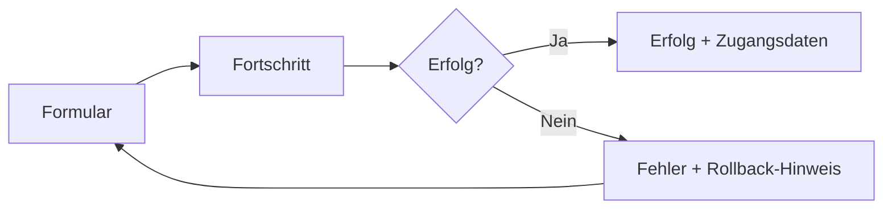

# Customer onboarding (Super Admin)

> **Audience:** Super Admin operators, support, FA maintainers.  
> **UI language:** German (de-AT). **Technical/API:** English.

Guides the **foolproof customer onboarding wizard** in Frontend Admin: one form, atomic server provisioning, progress UI, success handoff, optional welcome email, and automatic rollback on failure.

Related: [`TENANT_MANAGEMENT.md`](TENANT_MANAGEMENT.md), [`LICENSE_SYSTEM.md`](LICENSE_SYSTEM.md), [`MULTI_TENANT.md`](MULTI_TENANT.md), [`EMAIL_CONFIGURATION.md`](EMAIL_CONFIGURATION.md).

---

## Overview

| Item | Detail |
|------|--------|
| **Entry** | `/admin/tenants` → **Mandant anlegen** / **Neuen Kunden (Mandant) anlegen** |
| **UI component** | `CreateTenantWizard` (`frontend-admin/src/features/super-admin/components/CreateTenantWizard.tsx`) |
| **Backend** | `TenantOnboardingService.CreateAsync` → transaction + `TenantProvisioningService` |
| **API** | `POST /api/admin/tenants` (Super Admin JWT) |

The wizard replaces the legacy single modal: **form → processing steps → success modal** (or structured error with slug suggestions).

---

## Step-by-step flow (operator)



### 1. Form (German fields)


| Feld (DE) | API / code | Erklärung |
|-----------|------------|-----------|
| **Firmenname** | `name` | Anzeigename auf Belegen und in der Verwaltung (2–200 Zeichen). |
| **Subdomain / Adresse** | `slug` | Kürzel für `{slug}.regkasse.at` — nur `a-z`, `0-9`, `-`. Wird aus Firmenname vorgeschlagen. |
| **E-Mail (Kontakt)** | `email` | Kontakt des Unternehmens; dient auch als Admin-Anmeldung, wenn keine separate Admin-E-Mail gesetzt wird. |
| **Telefon / Adresse** | `phone`, `address` | Optional (eingeklappter Bereich „Weitere Angaben“). |
| **Demo-Lizenz (30 Tage)** | `grantTrialLicense` | Standard **aktiv** → `license_valid_until_utc = now + 30 days`. |
| **Demo-Produkte und Kasse** | `autoDemoSetup` (UI) | Immer mit Server-Provisioning verknüpft (Kasse + 3 Demo-Artikel). |

**Vorschau-URL:** `{slug}.{baseDomain}` — `baseDomain` aus `getTenantAppBaseDomain()` (z. B. `regkasse.at` / Dev `regkasse.local`).

**Admin-Zugang (automatisch):**

- E-Mail: Kontakt-E-Mail oder `admin@{slug}.regkasse.at`
- Passwort: serverseitig generiert (`GenerateCompliantPassword`), **einmalig** im Erfolgsdialog
- `MustChangePasswordOnNextLogin = true`

### 2. Processing (animated steps)

While `POST /api/admin/tenants` runs, `CreateTenantProcessingView` shows steps from `tenantOnboardingSteps.ts`:

| Step (DE key) | Server work |
|---------------|-------------|
| Firma wird angelegt … | Insert `tenants` row |
| Adresse wird aktiviert … | Slug committed |
| Administrator wird erstellt … | Identity user + owner membership |
| Demo-Lizenz wird aktiviert … | Only if `grantTrialLicense` |
| Kasse wird eingerichtet … | `KASSE-001` / *Hauptkasse* |
| Demo-Produkte werden angelegt … | Category *Allgemein* + 3 RKSV demo products |
| Zugangsdaten werden bereitgestellt … | Response DTO / welcome email (post-commit) |


**Hinweis im UI:** *„Falls ein Schritt fehlschlägt, wird automatisch zurückgerollt.“*

### 3. Success screen

`OnboardingSuccessModal` shows:

- Portal-URL: `https://{slug}.regkasse.at`
- **Einmalpasswort** (copy buttons, strength hint)
- Erste Schritte (DE): einloggen, Passwort ändern, Produkte, Drucker, Testverkauf
- Welcome-email status (sent / not sent)
- Actions: **Neuen Kunden anlegen**, **Zum Kunden wechseln** (impersonate / dev switch)


---

## Slug availability and suggestions

### Live check (form)

- Debounced call: `GET /api/admin/tenants/slug-availability?slug={slug}`
- UI: ✅ Verfügbar / Bereits vergeben / reserviert (`admin`, `www`, …)
- Normalization: `normalizeTenantSlugInput` (client) + `TenantSlugSuggestions.NormalizeSlug` (server)

### Suggestions on conflict

- `GET /api/admin/tenants/slug-suggestions?name={firmenname}&slug={preferred}&max=5`
- Used in `OnboardingErrorModal` when `errorCode` is `slug_taken` or `slug_invalid`
- Operator can click **Verwenden** to apply a suggestion back to the form

```bash
# Example (Super Admin JWT)
curl -H "Authorization: Bearer $TOKEN" \
  "https://admin.regkasse.at/api/admin/tenants/slug-suggestions?name=Cafe%20Beispiel&slug=cafe&max=5"
```

---

## Auto-provisioned assets

Executed inside **one database transaction** (`TenantOnboardingService`); failure → **rollback** (no partial tenant).

| Asset | Default | Notes |
|-------|---------|--------|
| Tenant row | `status=active`, `isActive=true` | |
| Cash register | `KASSE-001`, *Hauptkasse*, `Closed` | `RegisterStatus.Closed` |
| Category | *Allgemein*, 20% VAT | |
| Demo products | 3 RKSV demo articles | RKSV-compliant sample SKUs |
| Admin user | Manager role, **owner** membership | `user_tenant_memberships.is_owner=true` |
| Trial license | +30 days UTC | If `grantTrialLicense` and no explicit `licenseValidUntilUtc` |

Response field `provisioning` (one-time):

- `adminEmail`, `generatedPassword`
- `cashRegisterId`, `cashRegisterNumber`
- `categoryId`, `productIds[]`
- `trialLicenseValidUntilUtc`
- `welcomeEmailSent`, `forcePasswordChangeOnNextLogin`

---

## Welcome email (SMTP)

**Service:** `WelcomeEmailService` — `backend/Services/Email/WelcomeEmailService.cs`  
**Trigger:** After successful commit (outside transaction); failure does **not** roll back the tenant.

### Configuration (English)

```json
{
  "Email": {
    "Smtp": {
      "Host": "smtp.example.com",
      "Port": 587,
      "EnableSsl": true,
      "User": "api@example.com",
      "Password": "<secret>",
      "From": "noreply@regkasse.at"
    }
  }
}
```

Section: `EmailSmtpOptions.SectionName` = `"Email:Smtp"`.

### When SMTP is configured

| Item | Content |
|------|---------|
| **To** | `tenants.email` (Kontakt) or provisioning admin email |
| **Subject** | `Willkommen bei Regkasse – {TenantName}` |
| **Body (DE)** | Mandant name, portal URL, admin email, temporary password, first-login password change, numbered first steps |

### When SMTP is missing or send fails

- Onboarding still **succeeds**
- Audit: `TENANT_ONBOARDING_WELCOME_EMAIL` with status **Warning**
- FA success modal: *„SMTP ist nicht konfiguriert … Passwort nur hier angezeigt.“*
- Operator must copy credentials manually

---

## Error handling and rollback

### Transaction rollback

| Failure point | DB state | UI |
|---------------|----------|-----|
| Invalid / taken slug | No row | Error before transaction |
| Provisioning error (email taken, password policy, etc.) | **Rollback** | `OnboardingErrorModal` + `rollbackNote` |
| Unhandled exception | **Rollback** | Generic failure message |

German rollback hint: *„Es wurden keine Daten gespeichert (automatisches Zurückrollen).“*

### Structured error codes

Parsed in `parseTenantOnboardingError.ts`:

| Code | Operator message (DE) |
|------|------------------------|
| `slug_invalid` | Subdomain ungültig + Vorschläge |
| `slug_taken` | Subdomain vergeben + Vorschläge |
| `admin_email_taken` | E-Mail bereits vergeben |
| `provisioning_failed` | Einrichtung fehlgeschlagen |
| `unknown` | Allgemeiner Fehler |

API `400` body may include `errorCode`, `message`, `slugSuggestions[]`.

### Audit trail (system)

Correlation id per attempt; actions include:

- `TENANT_ONBOARDING_STARTED`
- `TENANT_ONBOARDING_TENANT_CREATED`
- `TENANT_ONBOARDING_PROVISIONED`
- `TENANT_ONBOARDING_WELCOME_EMAIL`
- `TENANT_ONBOARDING_COMPLETED`
- `TENANT_ONBOARDING_FAILED`

---

## API example (create)

```bash
curl -X POST "https://admin.regkasse.at/api/admin/tenants" \
  -H "Authorization: Bearer <super-admin-jwt>" \
  -H "Content-Type: application/json" \
  -d '{
    "name": "Café Beispiel GmbH",
    "slug": "cafe-beispiel",
    "email": "geschaeftsfuehrer@cafe-beispiel.at",
    "grantTrialLicense": true
  }'
```

---

## Key files

| Layer | Path |
|-------|------|
| Wizard UI | `frontend-admin/src/features/super-admin/components/CreateTenantWizard.tsx` |
| Form fields | `TenantFormFields.tsx`, `useTenantCreateFormFields.ts` |
| Progress | `CreateTenantProcessingView.tsx`, `useTenantOnboardingProgress.ts` |
| Errors / success | `OnboardingErrorModal.tsx`, `OnboardingSuccessModal.tsx` |
| Backend onboarding | `backend/Services/AdminTenants/TenantOnboardingService.cs` |
| Provisioning | `backend/Services/AdminTenants/TenantProvisioningService.cs` |
| Slug helpers | `backend/Services/AdminTenants/TenantSlugSuggestions.cs` |
| i18n (DE) | `frontend-admin/src/i18n/locales/de/tenants.json` → `create.*`, `onboarding.*`, `provisioning.*` |

---

## Screenshots

Place PNGs under `docs/images/onboarding/` (see [`images/onboarding/README.md`](images/onboarding/README.md)).
