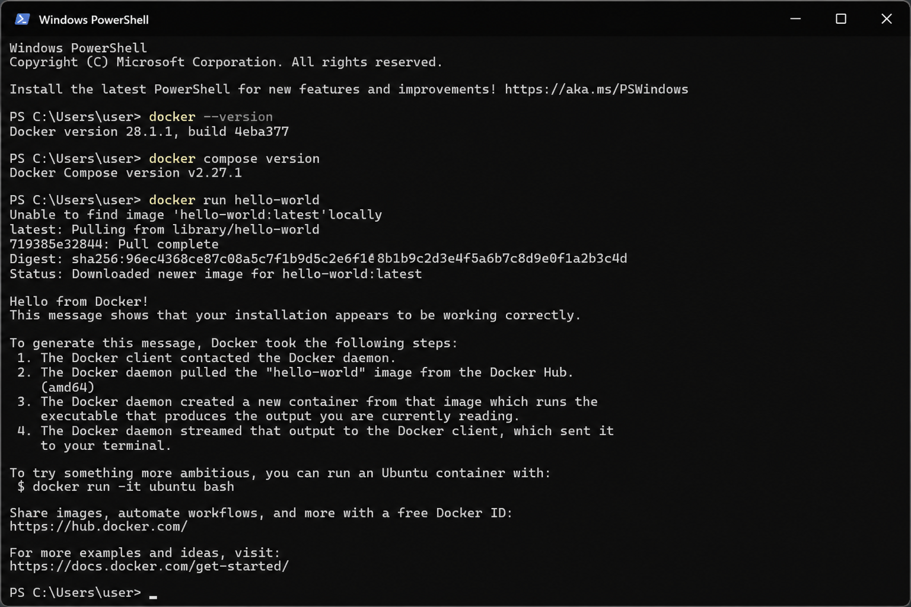
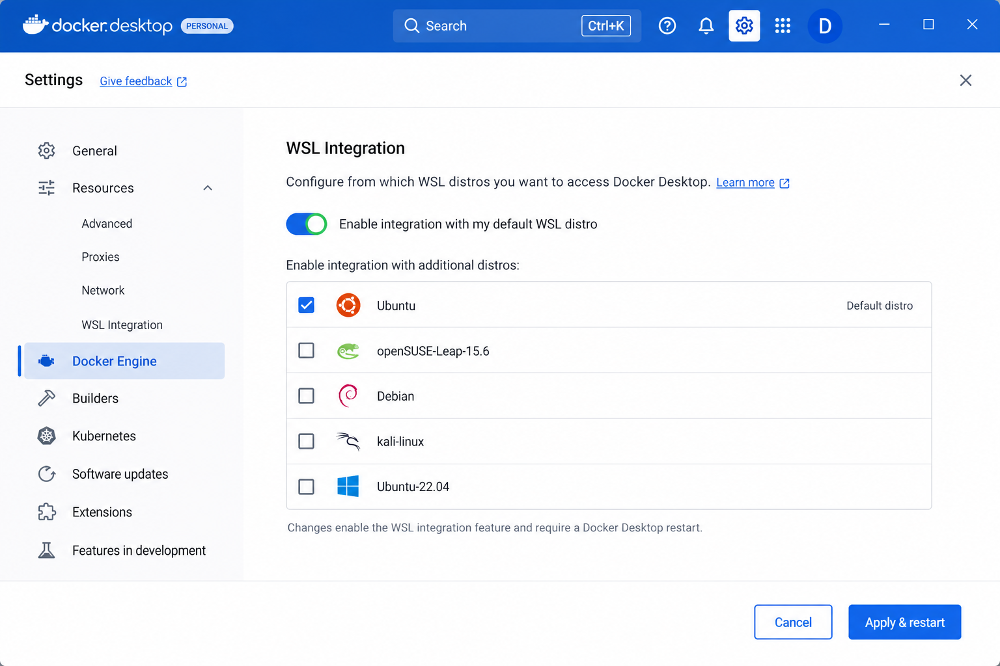
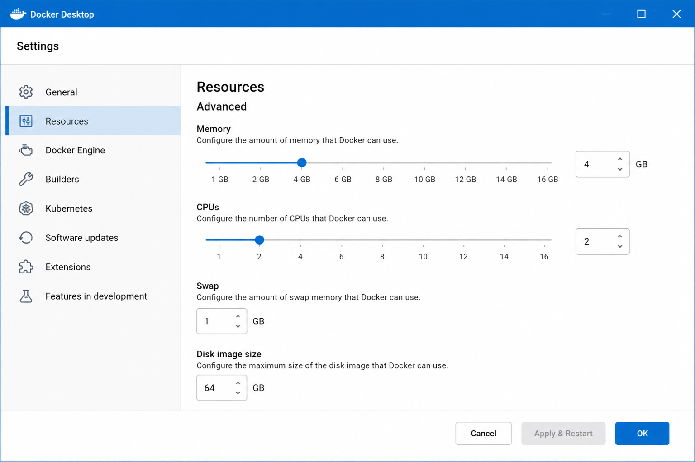

# Docker Desktop setup on Windows (WSL2)

Step-by-step guide to install Docker Desktop on Windows with the **WSL 2** backend so you can run Regkasse’s root [`docker-compose.yml`](../docker-compose.yml), local Postgres, Redis, and Testcontainers-based backend tests.

| Language | Doc |
|----------|-----|
| **English (this page)** | [`DOCKER_WINDOWS_SETUP.md`](DOCKER_WINDOWS_SETUP.md) |
| **Deutsch** | [`DOCKER_WINDOWS_SETUP.de.md`](DOCKER_WINDOWS_SETUP.de.md) |

**Related:** Hub [`DOCKER.md`](DOCKER.md) · Troubleshooting [`DOCKER_WINDOWS_TROUBLESHOOTING.md`](DOCKER_WINDOWS_TROUBLESHOOTING.md) · [`../DEVELOPMENT.md`](../DEVELOPMENT.md#docker-compose-full-stack) · [Docker Desktop install docs](https://docs.docker.com/desktop/setup/install/windows-install/)

**Last updated:** 2026-07-29

---

## Prerequisites

| Requirement | Notes |
|-------------|--------|
| **OS** | Windows 10 64-bit (22H2+) or Windows 11 64-bit |
| **CPU** | 64-bit with SLAT; hardware virtualization (Intel VT-x / AMD-V) **enabled in BIOS/UEFI** |
| **RAM** | **8 GB system RAM** recommended (Docker Desktop official minimum for WSL 2); Regkasse Compose needs headroom for Postgres + Redis + API + Admin |
| **Disk** | ≥ **20 GB** free (images + Compose build cache); more if you keep many tags |
| **Account** | Admin rights for enabling Windows features and first reboot |
| **Network** | Access to download Docker Desktop and pull images from Docker Hub |

Quick checks (PowerShell):

```powershell
systeminfo | findstr /B /C:"OS Name" /C:"OS Version"
wsl --status
# Virtualization should report "Enabled" (Task Manager → Performance → CPU also shows this)
```

---

## Overview

```text
1. Enable WSL + Virtual Machine Platform
2. Set WSL default version to 2
3. Install Docker Desktop (WSL2 backend)
4. Restart Windows
5. Configure WSL Integration + resources
6. Verify: docker / compose / hello-world
7. (Optional) Start Regkasse Compose stack
```

---

## 1. Enable WSL 2

Open **PowerShell as Administrator** (Start → type `PowerShell` → right-click → **Run as administrator**).

```powershell
# Run as Administrator
dism.exe /online /enable-feature /featurename:Microsoft-Windows-Subsystem-Linux /all /norestart
dism.exe /online /enable-feature /featurename:VirtualMachinePlatform /all /norestart
wsl --set-default-version 2
```

### Alternative (Windows 11 / recent Windows 10)

If `wsl --install` is available, you can use the one-shot installer (Ubuntu by default), then still set version 2:

```powershell
# Run as Administrator
wsl --install
wsl --set-default-version 2
wsl --update
```

### Install a Linux distro (recommended)

Docker Desktop works best with at least one WSL 2 distro (e.g. Ubuntu):

```powershell
wsl --list --online
wsl --install -d Ubuntu
wsl -l -v
```

Confirm the distro shows **VERSION 2**. If it shows `1`, convert it:

```powershell
wsl --set-version Ubuntu 2
```

**Restart Windows** after enabling features (required before Docker Desktop can use the WSL 2 backend).

---

## 2. Install Docker Desktop

1. Download the installer: [https://www.docker.com/products/docker-desktop/](https://www.docker.com/products/docker-desktop/)
2. Run **Docker Desktop Installer.exe**.
3. On the configuration screen, keep:
   - **Use WSL 2 instead of Hyper-V** (recommended)
   - **Add shortcut to desktop** (optional)
4. Finish the wizard, then **restart the computer** when prompted.
5. After reboot, start **Docker Desktop** from the Start menu and complete the first-run onboarding (accept the Service Agreement if required).

Wait until the whale icon in the system tray shows **Docker Desktop is running** (Engine started).

> **Note:** Corporate machines may need IT approval for Docker Desktop licensing. Personal / small-business use may fall under Docker’s current free tiers — check [Docker Desktop license](https://docs.docker.com/subscription/desktop-license/) for your org size.

---

## 3. Verify installation

Open a **new** PowerShell or Windows Terminal window (so `PATH` picks up Docker):

```powershell
docker --version
docker compose version
docker run hello-world
```

Expected:

- `docker --version` → `Docker version …`
- `docker compose version` → Compose **v2** (`Docker Compose version v2.x`)
- `hello-world` pulls the image and prints a success message ending with *Hello from Docker!*



*Illustrative verification output — your version numbers will differ.*

If `docker` is not recognized, quit Docker Desktop fully and reopen the terminal, or log out/in once.

---

## 4. Configure Docker Desktop

Open **Settings** (gear icon) in Docker Desktop.

### 4.1 WSL Integration

**Settings → Resources → WSL Integration**

1. Enable **Enable integration with my default WSL distro**.
2. Enable integration for your distro(s) (e.g. **Ubuntu**).
3. Click **Apply & restart**.



*Illustrative Settings → Resources → WSL Integration panel.*

Also confirm under **Settings → General**:

- **Use the WSL 2 based engine** is checked.

### 4.2 Resources (RAM / CPU)

**Settings → Resources → Advanced** (or the Resources panel for your backend)

Set at least:

| Resource | Minimum for Regkasse Dev | Comfortable |
|----------|--------------------------|-------------|
| **Memory** | **4 GB** | 6–8 GB |
| **CPUs** | **2** | 4 |
| **Swap** | Default / 1 GB | 2 GB |
| **Disk image size** | Leave default unless you hit “disk full” | Grow as needed |



*Illustrative Resources panel — set Memory ≥ 4 GB and CPUs ≥ 2, then Apply & restart.*

> On WSL 2, memory is often managed by the WSL VM (`.wslconfig`). If the Advanced sliders are limited or missing, create `%UserProfile%\.wslconfig` (see [Troubleshooting](#troubleshooting)).

### 4.3 Optional but useful

| Setting | Recommendation |
|---------|----------------|
| **Settings → General → Start Docker Desktop when you sign in** | On if you run Compose / tests daily |
| **Settings → Docker Engine** | Leave defaults unless you need registry mirrors / insecure registries |
| **Settings → Resources → File sharing** | Not required for WSL 2 Linux paths; Windows drive mounts work via `/mnt/c/...` inside WSL |

---

## 5. Smoke-test with Regkasse

From the repository root (PowerShell):

```powershell
# One-off Postgres (optional)
docker run --name regkasse-pg `
  -e POSTGRES_PASSWORD=postgres `
  -e POSTGRES_DB=kasse_db `
  -p 5432:5432 `
  -d postgres:16

# Or full stack — see DEVELOPMENT.md
copy .env.example .env
# Edit .env: set JWT_SECRET_KEY to ≥32 random characters
docker compose up --build
```

Health checks:

```powershell
curl -fsS http://localhost:5184/api/health/live
docker compose ps
```

Backend PostgreSQL integration tests (Testcontainers) need a running Docker engine:

```powershell
cd backend
dotnet test --filter "Category=PostgreSql"
```

Full Compose details: [`DEVELOPMENT.md`](../DEVELOPMENT.md#docker-compose-full-stack).

---

## Troubleshooting

Short table below. **Full Windows guide** (install / runtime / performance / network + diagnostic script): [`DOCKER_WINDOWS_TROUBLESHOOTING.md`](DOCKER_WINDOWS_TROUBLESHOOTING.md).

```powershell
.\scripts\docker-diagnose.ps1
```

| Symptom | Likely cause | Fix |
|---------|--------------|-----|
| `wsl --set-default-version 2` fails | Features not enabled / reboot pending | Re-run DISM commands as Admin, **reboot**, then retry |
| Distro stuck on WSL 1 | Version not converted | `wsl --set-version <DistroName> 2` |
| Docker Desktop: “WSL 2 installation is incomplete” | Missing/outdated kernel update | Install [WSL2 kernel update](https://aka.ms/wsl2kernel), then `wsl --update` |
| `Hardware assisted virtualization is not enabled` | BIOS/UEFI VT-x / AMD-V / SVM off | Enable virtualization in firmware; ensure Hyper-V / Virtual Machine Platform can run |
| Conflict with VirtualBox / VMware / other hypervisors | Nested virt / exclusive hypervisor | Prefer WSL 2 + Docker Desktop alone, or enable hypervisor compatibility per vendor docs |
| `docker: command not found` / not in PATH | Engine not running or shell opened before install | Start Docker Desktop; open a **new** terminal |
| `error during connect` / `Docker Desktop is starting…` forever | Engine stuck | Quit Docker Desktop → `wsl --shutdown` → start Docker Desktop again |
| `hello-world` pull fails / timeout | Network / proxy / firewall | Configure proxy under **Settings → Resources → Proxies**; allow Docker Hub |
| Port `5432` / `5184` / `3000` already in use | Local Postgres or another stack | `netstat -ano \| findstr :5432` — change ports in `.env` or stop the conflicting service |
| Volume / “path is not shared” | File sharing / NTFS bind mounts | Settings → Resources → File sharing, or clone under WSL (`\\wsl$\…`) |
| Compose builds OOM / killed | Too little RAM for WSL | Raise Memory to ≥ 4 GB (Resources) or set `.wslconfig` memory; close heavy apps |
| Very slow bind mounts from `C:\…` | Windows filesystem ↔ Linux VM | Prefer cloning the repo under the WSL filesystem (`\\wsl$\Ubuntu\home\…`) for heavy Compose builds |
| Windows Defender / AV slows builds | Real-time scan of Docker volumes | Add exclusions for Docker data / WSL VHDX only if security policy allows |
| Corporate proxy SSL errors | MITM TLS inspection | Import corp CA into Docker / WSL trust store per IT guidance |

### Reset WSL / Docker (last resort)

```powershell
# Stops all WSL distros and Docker's WSL VMs — discard unsaved work in Linux first
wsl --shutdown
```

Then restart Docker Desktop. To reclaim disk after many images:

```powershell
docker system prune -a
# Careful: removes unused images/containers/networks
```

### Cap WSL memory (`.wslconfig`)

Create or edit `%UserProfile%\.wslconfig`:

```ini
[wsl2]
memory=6GB
processors=4
swap=2GB
```

Then:

```powershell
wsl --shutdown
```

Restart Docker Desktop so the new limits apply.

---

## Checklist

- [ ] WSL + Virtual Machine Platform enabled; default version **2**
- [ ] At least one WSL 2 distro installed (`wsl -l -v`)
- [ ] Docker Desktop installed with **WSL 2** backend; PC restarted
- [ ] WSL Integration enabled for your distro
- [ ] Resources: ≥ **4 GB** RAM, ≥ **2** CPUs
- [ ] `docker --version`, `docker compose version`, `docker run hello-world` succeed
- [ ] (Optional) `docker compose up --build` from repo root works

---

## References

- [Install Docker Desktop on Windows](https://docs.docker.com/desktop/setup/install/windows-install/)
- [Docker Desktop WSL 2 backend](https://docs.docker.com/desktop/features/wsl/)
- [Install WSL (Microsoft)](https://learn.microsoft.com/windows/wsl/install)
- Regkasse: [`DEVELOPMENT.md`](../DEVELOPMENT.md) · root [`docker-compose.yml`](../docker-compose.yml) · [`.env.example`](../.env.example)
- Troubleshooting: [`DOCKER_WINDOWS_TROUBLESHOOTING.md`](DOCKER_WINDOWS_TROUBLESHOOTING.md) ([DE](DOCKER_WINDOWS_TROUBLESHOOTING.de.md)) · [`../scripts/docker-diagnose.ps1`](../scripts/docker-diagnose.ps1)
- Hub: [`DOCKER.md`](DOCKER.md) · [`DOCKER.de.md`](DOCKER.de.md)

