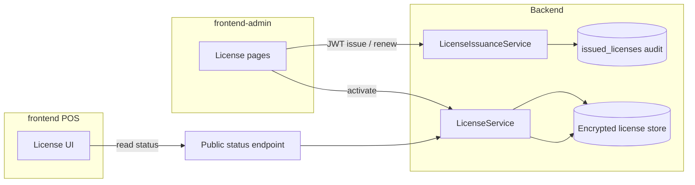

# License management — design (Regkasse POS monorepo)

This document specifies a coherent license lifecycle: backend as source of truth, frontend-admin (FA) for issuance and operator workflows, POS for read-only status, renewal UX, and fiscal gating alignment. **No implementation code** — design and migration guidance only.

---

## 1. Goals and scope

### 1.1 Problems addressed

| Issue | Desired outcome |
|-------|-----------------|
| POS “Lizenz verlängern” opens `https://www.regkasse.at` (DNS failure) | Renewal actions use **configurable** URLs (FA deep link, support mail, or marketing URL when real). |
| FA license UI may feel “disconnected” | FA calls the **same** backend APIs the server enforces; failures surface clearly (auth, signing key missing, validation errors). |
| No integration between POS renewal and FA issuance | **Deep link** from POS → FA license route with **machine hash** (and optional license key) pre-filled; optional **email template** with same parameters. |

### 1.2 Product rules

- **Backend** validates and persists license state; fiscal-sensitive flows consult this state (existing patterns: headers, payment checks — preserve and centralize where possible).
- **FA** creates/manages licenses for operators with appropriate RBAC (see §7.3 for current vs desired roles).
- **POS** reads **anonymous-safe** status; does not hold signing keys; may trigger **refresh** after activation performed elsewhere.

### 1.3 Non-goals (initial phase)

- Replacing the entire `ILicenseStorageService` (encrypted local file) in one step — optional later convergence with DB-backed “active license” row.
- Public multi-tenant SaaS license portal without authentication.

---

## 2. Current state (baseline)

Grounded in the repository as of this design:

### 2.1 Backend

- **`ILicenseService` / `LicenseService`**: startup evaluation, trial window, JWT-based activation, machine hash surfaced in status. Persistence via **`ILicenseStorageService`** (encrypted file), not solely DB.
- **`LicenseService` registration**: `AddSingleton<LicenseService>()`; `ILicenseService` → `ProductionLicenseService` adapter (`LicenseServiceRegistration.cs`).
- **Database access**: singleton uses **`IServiceScopeFactory`** per operation; resolves scoped `IDbContextFactory<AppDbContext>` inside the scope (never from root provider — avoids `ICurrentTenantAccessor` resolution errors). In-memory `_snapshot` after `EvaluateOnStartup()`; **not** `IMemoryCache`.
- **`activated_licenses`**: deployment-local (machine fingerprint); **not** `ITenantEntity` / tenant-filtered.
- **`license_sales` + `Billing.TenantLicenseService` (2026-06):** Super Admin records Mandanten-SaaS sales; billing keys `REGK-{yyyyMMdd}-{slug}-…`; Manager `POST /api/admin/license/extend`. See **`docs/BILLING_TENANT_LICENSE.md`**.
- **`AdminLicenseController`** (`/api/admin/license/*`): deployment status, issuance lifecycle, **and** `POST extend` (billing mandant extend for Managers with `settings.manage`). Mandant overview/legacy extend: `GET/POST …/mandant/*` (`license.manage`).
- **Anonymous diagnostic**: `GET /api/health/license` — exposes `isValid`, trial/expiry, `daysRemaining`, `machineHash`, reminders, header hint fields. Used by POS today.
- **`IssuedLicense` entity** (`issued_licenses`): audit trail for generated JWTs; masked keys in list APIs; JWT treated as secret in transit.

### 2.2 Frontend-admin

- Route: `(protected)/admin/license` with cards for status, activation, **LicenseGenerationCard**, issued licenses table, upgrade modal.
- Manual API client: `frontend-admin/src/api/manual/adminLicense.ts` → same `/api/admin/license/*` paths.

### 2.3 POS (frontend)

- **`useLicenseStatus`**: polls `GET /api/health/license` (~10 min).
- **`LicenseStatusIndicator`**: German UI; opens renewal URLs from **`frontend/constants/licenseRenewal.ts`** (`LICENSE_RENEWAL_URL` → broken `www.regkasse.at`).
- **Fiscal gating**: must remain consistent with backend enforcement (payment / compliance services — do not rely on POS-only checks).

### 2.4 RBAC note (requirements vs code)

- Requirement text mentions **SuperAdmin and Manager**.
- Representative tests indicate **`settings.manage`** (used for generate/activate/list mutations) is allowed for **SuperAdmin** and **denied for Manager** today.
- Design decision (product): either **narrow** the requirement to SuperAdmin-only issuance, or **extend** the permission matrix and FA route guards so Manager can run a **subset** (e.g. activate only, no signing key).

---

## 3. Target architecture

- **Single validation path** inside `LicenseService` (verify RS256 JWT, claims, `exp`, optional `machineHash` binding, revocation/supersession rules against `issued_licenses` when applicable).
- **FA** never validates JWTs locally for “truth” — it displays tokens and calls backend **activate** so the server persists trusted state.
- **POS** only consumes **read** APIs and deep links; activation on device (if ever added) would call the same backend **activate** contract behind appropriate auth (likely **not** cashier — see API section).

---

## 4. Data structures

Naming below is **contract-oriented**; map to existing `LicenseStatusResponse`, `ActivateLicenseRequest`, and admin DTOs to avoid duplicate shapes where possible.

### 4.1 `LicenseStatusDto` (read — POS & FA)

Stable JSON for UI and gating hints (superset of current health payload; keep backward compatible fields).

| Field | Type | Description |
|-------|------|-------------|
| `isValid` | boolean | License/trial allows configured operations. |
| `isTrial` | boolean | Trial mode. |
| `isExpired` | boolean | Explicit expiry or invalid state. |
| `daysRemaining` | integer | UI countdown; `0` when expired; sentinel for “unlimited” if product keeps current convention. |
| `expiryDate` | string \| null | ISO 8601 UTC; `null` = no `exp` (unlimited paid) if supported. |
| `machineHash` | string | Lowercase hex SHA-256 of device fingerprint (for FA prefill / support). |
| `licenseType` | string (enum) | e.g. `trial`, `paid`, `none` — optional clarity vs inferring from booleans. |
| `features` | string[] | **Future**: feature flags encoded in JWT claims (e.g. `rksv`, `multiOutlet`). Start empty or omit until JWT carries them. |
| `reminders` | array | Optional operator notices (existing reminder store). |
| `headerStatus` | string | Optional echo for middleware compatibility (`X-License-Status` mapping). |

### 4.2 `LicenseActivateRequest`

| Field | Type | Required | Description |
|-------|------|----------|-------------|
| `licenseKey` | string | Yes | `REGK-…` formatted key. |
| `offlineActivationJwt` | string | No | RS256 JWT from issuance; primary activation proof. |

**Response:** `LicenseActivateResponse`

| Field | Type | Description |
|-------|------|-------------|
| `success` | boolean | |
| `message` | string \| null | English technical message for logs; FA maps to i18n. |

### 4.3 `LicenseIssueRequest` (FA → backend generate/renew)

Align with existing `GenerateLicenseRequestBody` / renew bodies; document as:

| Field | Type | Description |
|-------|------|-------------|
| `customerName` | string | Audit / support label. |
| `expiryDate` | date (YYYY-MM-DD) | End-of-day UTC rule (existing backend behavior). |
| `requireFingerprint` | boolean | Machine-bound vs floating. |
| `machineHashHex` | string \| null | Required when `requireFingerprint` is true. |

**Response:** `LicenseIssueResponse` — `licenseKey`, `signedJwt`, `expiryAtUtc`, `success`, `message`.

### 4.4 `LicenseExtensionLinkParams` (deep link / clipboard)

Not necessarily a REST body; used for “Copy POS extension link”.

| Field | Type | Description |
|-------|------|-------------|
| `baseUrl` | string | FA origin, e.g. `https://admin.customer.tld`. |
| `path` | string | e.g. `/admin/license`. |
| `machineHash` | string | From status DTO. |
| `licenseKey` | string \| null | Optional; if masked in UI, omit or use full key only when operator copies from secure issuance flow. |

Example query: `?machineHash=...&intent=extend` (exact naming to be chosen once routing implemented).

### 4.5 `LicenseExtensionRequest` (optional email / ticket API)

If backend adds **POST `/api/license/extension-request`** (authenticated or anonymous with rate limit):

| Field | Type | Description |
|-------|------|-------------|
| `contactEmail` | string | Customer reply-to. |
| `organizationName` | string | Optional. |
| `machineHash` | string | From POS status. |
| `currentExpiry` | string \| null | ISO; helps support. |
| `message` | string | Free text from operator. |

**Response:** `202 Accepted` with `requestId` — actual email via configured SMTP/queue.

---

## 5. API endpoints

### 5.1 Principles

- **POS read**: anonymous or session-scoped **read-only**; must not leak PII or secrets (no JWT in status).
- **FA write**: authenticated; issuance needs **signing private key** on server (`License:SigningPrivateKeyPem` — existing pattern); return JWT only over TLS to trusted operators.
- **Backward compatibility**: keep **`GET /api/health/license`** during migration; new routes can delegate to the same service methods.

### 5.2 Proposed public POS contract (new)

| Method | Path | Auth | Purpose |
|--------|------|------|---------|
| `GET` | `/api/license/status` | **AllowAnonymous** (or optional API key later) | Stable, versioned read model (`LicenseStatusDto`). Same underlying data as health endpoint. |
| `POST` | `/api/license/refresh` | Anonymous | Optional no-op or “re-read storage” if file-based cache ever introduced; default may be unnecessary if storage is always fresh. **Skip unless needed.** |

**Deprecation path:** document `/api/health/license` as **legacy alias**; POS migrates to `/api/license/status` when convenient.

### 5.3 FA / operator contract (existing + clarify)

| Method | Path | Permission | Purpose |
|--------|------|------------|---------|
| `GET` | `/api/admin/license/status` | `settings.view` | Operator-visible status + reminders. |
| `POST` | `/api/license/activate` | **AllowAnonymous** (JWT optional; FA sends bearer for audit `InitiatingUserId` + `app_context` claim; POS may send `X-App-Context: pos`) | Unified activation (same body/response for FA and POS). |
| `POST` | `/api/admin/license/generate` | `settings.manage` | Issue JWT + DB audit row. |
| `GET` | `/api/admin/license/list` | `settings.manage` | Audit list (masked keys). |
| `POST` | `/api/admin/license/renew` | `settings.manage` | Renewal / new JWT. |
| … | other existing routes | as today | transfer, upgrade, revoke. |

### 5.4 Optional extension-request (new)

| Method | Path | Auth | Purpose |
|--------|------|------|---------|
| `POST` | `/api/license/extension-request` | Anonymous **with strict rate limit** + CAPTCHA optional, **or** `settings.view` session | Sends email to `support@regkasse.at` (or config). |

**Risk:** spam; prefer **mailto:** fallback in POS v1 and add API only if product requires tracked tickets.

### 5.5 POS device activation (implemented)

- `POST /api/license/activate` accepts `{ licenseKey, offlineActivationJwt?, machineFingerprint? }`; **auth optional** (device-bound activation).
- FA continues to use the same endpoint with a logged-in session so `activated_licenses.created_by_user_id` can be populated when available.

---

## 6. Frontend flows

### 6.1 FA — license generation

1. Operator opens **Admin → License**.
2. Enters customer name, expiry, fingerprint requirement, optional `machineHash` (from POS status modal or support).
3. FA calls `POST /api/admin/license/generate`.
4. On success: show **license key** + **JWT**; copy buttons; store row in `issued_licenses` (already server-side).
5. On 503: signing key not configured — show actionable error (English log, German UI).

### 6.2 FA — activation

1. Operator pastes **license key** + **offline JWT** (or flow that loads JWT from issuance response).
2. FA calls `POST /api/license/activate` (same contract as POS; optional header `X-App-Context: admin` when needed).
3. Backend validates signature, claims, machine binding, revocation tables; writes **`ILicenseStorageService`** state.
4. FA refreshes `GET /api/admin/license/status`.

### 6.3 FA — “Copy POS extension link”

1. After reading **machine hash** from status (or from issued row):
2. Build URL: `{NEXT_PUBLIC_ADMIN_BASE_URL}/admin/license?machineHash={hash}&intent=extend`.
3. Copy to clipboard; operator sends link to customer IT to open FA on correct host.
4. FA page reads query params and pre-fills **LicenseGenerationCard** / renew forms.

**Config:** FA base URL must come from **environment** (per deployment), not hardcoded `regkasse.at`.

### 6.4 POS — status display

1. On interval / focus: `GET /api/license/status` (or legacy `/api/health/license`).
2. Badge + modal show German strings; **no English** in POS UI copy.

### 6.5 POS — “Lizenz verlängern”

**When online:**

1. **Primary:** open FA URL in **in-app browser** (`expo-web-browser`) or external browser:
   - `LICENSE_RENEWAL_FA_URL` from config (e.g. `EXPO_PUBLIC_LICENSE_ADMIN_URL` + path + `machineHash`).
2. **Secondary:** `mailto:support@regkasse.at` with **subject/body** including `machineHash`, `daysRemaining`, `expiryDate` (German body template, technical identifiers as-is).
3. **Tertiary:** `refetch()` status after user returns from browser (auto-check for new license).

**When offline:**

- Hide or disable FA deep link; show mail + “try again when online” German messaging.

### 6.6 Fiscal operations gating

- **Backend** remains authoritative: payment / compliance paths must reject fiscal operations when license invalid (existing behavior to audit and align with `LicenseStatusDto`).
- POS should **mirror** for UX (disable pay button, show banner) but must not be sole enforcement.

---

## 7. Security notes

### 7.1 Signing and validation

- **Algorithm:** RS256 (or ES256 if keys rotated with migration plan). Private key **only** on backend for issuance; public key in config for verification.
- **Claims (minimum):** `exp`, `machineHash` (when bound), `licenseKey` or `jti`, `customerName` (non-sensitive), optional `features`.
- **Storage:** JWT in `issued_licenses` is sensitive — never log full JWT; mask license keys in list endpoints (already aligned).

### 7.2 Machine binding

- Fingerprint = stable **SHA-256** over normalized hardware/software identifiers (document the exact composition in implementation PR).
- On activation: **reject** if JWT `machineHash` ≠ current machine when `requireFingerprint` is true.

### 7.3 Authorization

- Split **read** (`settings.view`) vs **mutate** (`settings.manage`) consistently.
- If Managers must activate: add **`settings.license.activate`** or extend Manager matrix with care (separation from backup/restore superpowers).

### 7.4 Transport and CORS

- FA and API share TLS; no JWT in query strings for **activation** (POST body only). Deep links may carry **machineHash** only (lower risk than JWT).

### 7.5 Rate limiting

- Anonymous `extension-request` and any future public activate must be rate-limited and monitored.

---

## 8. Configuration (deployment)

| Key | Consumer | Purpose |
|-----|----------|---------|
| `License:SigningPrivateKeyPem` | Backend | Issue JWT (FA generate). |
| `License:PublicKeyPem` (or embedded) | Backend | Verify JWT. |
| `NEXT_PUBLIC_LICENSE_ADMIN_URL` | POS | FA deep link base for renewal. |
| `LICENSE_SUPPORT_EMAIL` | POS / FA | Mailto target (default `support@regkasse.at`). |
| Optional `LICENSE_MARKETING_URL` | POS | Replace broken marketing link when site live. |

---

## 9. Migration steps

### Phase A — Documentation and config (no behavior change)

1. Add this design doc; align stakeholders on RBAC (Manager vs SuperAdmin).
2. Introduce **env-based URLs** in POS constants (replace hardcoded `www.regkasse.at` with `EXPO_PUBLIC_*` fallbacks documented in `.env.example`).

### Phase B — API surface cleanup

1. Implement `GET /api/license/status` as thin wrapper over `ILicenseService.GetStatus()` + reminders (same JSON as health or superset with version field).
2. Mark `/api/health/license` deprecated in OpenAPI comments; keep functional.
3. Update POS `useLicenseStatus` to prefer `/api/license/status` with fallback to health during rollout.

### Phase C — FA ↔ backend hardening

1. Verify `LicenseGenerationCard` sends correct `machineHashHex` when `requireFingerprint` true.
2. E2E smoke: generate → activate → status shows paid/expiry.
3. Add **“Copy POS extension link”** using env base URL + query params; document required FA route handler for prefill.

### Phase D — Renewal UX

1. Replace `LICENSE_RENEWAL_URL` default with FA deep link or support page that **exists**.
2. Implement mailto template with machine hash + expiry.
3. Optional: `POST /api/license/extension-request` if mailto insufficient.

### Phase E — Features in JWT (optional)

1. Add `features` claim at issuance; propagate to `LicenseStatusDto`; consume in fiscal feature flags.

### Phase F — Persistence convergence (optional, larger)

1. Evaluate DB-backed active license row vs file-only storage for multi-instance deployments.

---

## 10. Testing strategy

- **Backend unit:** JWT sign/verify, expiry edge cases, machine mismatch, revoked/superseded rows.
- **Integration:** Admin generate → activate → GET status; anonymous POS status after activation.
- **FA:** React Query mutations with mocked axios; clipboard util.
- **POS:** Hook normalization; deep link construction from env.

---

## 11. Open questions

1. **Manager role:** Should issuance/renew live under SuperAdmin only permanently?
2. **Multi-node deployment:** Is encrypted **local** file storage sufficient, or is clustered API + shared storage required?
3. **Marketing site:** Will `www.regkasse.at` go live, or should all renewal traffic route to FA per tenant?
4. **POS on-device activation:** Explicitly out of scope for v1?

---

## 12. Summary

The codebase already contains a **solid backbone** (`LicenseService`, admin license APIs, `issued_licenses`, POS health endpoint). This design aligns naming around **`GET /api/license/status`**, fixes renewal UX via **configurable FA deep links and mailto**, connects FA issuance to backend **without duplicating validation client-side**, and documents DTOs and RBAC gaps before implementation.
