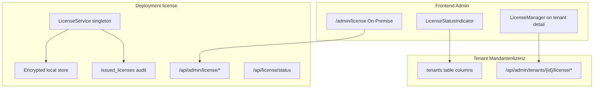

# License system (Regkasse)

> Distinguishes **deployment (server) license** from **tenant (Mandant) SaaS license**, and documents how Frontend Admin (FA) surfaces each role.  
> For issuance JWT design and POS renewal, see also [`LICENSE_MANAGEMENT_DESIGN.md`](LICENSE_MANAGEMENT_DESIGN.md).

## Terminology (German ↔ English)

| German (operator UI) | English (technical) | Storage / API |
|----------------------|----------------------|---------------|
| Server-Lizenz / On-Premise | **deployment license** | `LicenseService`, encrypted file store, `activated_licenses`, `issued_licenses` |
| Mandantenlizenz | **tenant license** | `tenants.license_key`, `tenants.license_valid_until_utc` |
| Testversion | trial | No key or ≤31 days remaining (UI heuristic) |
| LIZENZIERT | valid / paid | `license_key` set and not in trial window |
| Maschinen-Fingerprint | machine hash | SHA-256 hex in deployment status / JWT binding |

---

## Two license layers



### Deployment license

- **Purpose:** Entitle the **API host** (and features like `admin_license_manage`, RKSV tooling) and POS devices via activation JWT.
- **Not tenant-scoped:** `activated_licenses` is machine/deployment-local; singleton `LicenseService` uses `IServiceScopeFactory` for DB (see `MULTI_TENANT.md` § Background services).
- **FA route:** `/admin/license` — German title *„Server-Lizenz (On-Premise)“* (`license.page.title`).
- **Client:** `frontend-admin/src/api/manual/adminLicense.ts`, `LicenseReportsCard`, generation/activation cards.

### Tenant (Mandant) license

- **Purpose:** SaaS subscription for a **company** (tenant row); shown in Super Admin tenant list/detail and Manager header when on tenant host.
- **Provisioning default:** new tenant create with `grantTrialLicense: true` → `license_valid_until_utc = now + 30 days` if not explicitly set (`TenantProvisioningService`).
- **Super Admin ops:** extend key/date, activate trial, set tier — `LicenseManager` + `adminTenantLicense.ts`.
- **Does not replace** deployment license: FA shell explicitly states the admin UI itself is not license-gated (`license.badge.tenant.baseTooltip`).

---

## FA display by role

| Role / context | Deployment license UI | Tenant license UI |
|----------------|----------------------|-------------------|
| **Super Admin** on `admin.*` (platform mode) | `/admin/license` allowed; header **no** deployment badge; `TenantBadge` = *Super Admin Modus* | Tenant list/detail columns; **no** `LicenseExpiryBanner` / `LicenseStatusIndicator` (`suppressLicenseWarnings`) |
| **Super Admin** impersonating tenant | Same as tenant context for data APIs; badge purple (impersonation) | Mandant data via impersonation JWT |
| **Manager** on `{slug}.*` | `/admin/license` if `settings.view` | `LicenseStatusIndicator` + `LicenseExpiryBanner` |
| **Dev** any role | `HeaderDevTenantSwitch` shows mandant license tag per row | Uses `GET /api/tenants/switcher` |

### Header components

| Component | File | When visible |
|-----------|------|--------------|
| `TenantBadge` | `components/admin-layout/TenantBadge.tsx` | Any authenticated user; platform vs mandant labels |
| `LicenseStatusIndicator` | `components/admin-layout/LicenseStatusIndicator.tsx` | `useHeaderTenantLicense` → `mode === 'tenant'` (Manager mandant only) |
| `LicenseExpiryBanner` | `components/admin-layout/LicenseExpiryBanner.tsx` | Manager mandant grace/lockdown; **not** deployment license |

`useHeaderTenantLicense` reads mandant fields from **`useCurrentTenant`** (`licenseValidUntilUtc`, `licenseKey`, `licenseDaysRemaining`) resolved via `GET /api/tenants/switcher` — **not** `/api/admin/license/deployment-status`.

```typescript
// useHeaderTenantLicense — mandant row from useCurrentTenant (GET /api/tenants/switcher)
resolveHeaderTenantLicenseLabel(
    ctx.licenseValidUntilUtc,
    ctx.licenseKey,
    ctx.licenseDaysRemaining,
);
```

`showTenantLicenseInHeader` is true for **Manager** on a real tenant slug (`useCurrentTenant.ts`).

---

## Expiry warnings (colors & tooltips)

### Header tag (`LicenseStatusIndicator`)

Uses `useHeaderTenantLicense` + `headerLicenseStatus.ts` (German short labels via `license.badge.headerShort.*`). **Always visible** for Manager on tenant host when mandant context resolves — including valid licenses (green).

| Condition | CSS class | German label (i18n) |
|-----------|-----------|---------------------|
| `license_valid_until_utc` null | `expired` (red) | `license.badge.headerShort.none` — *Keine Mandantenlizenz* |
| End date in the past | `expired` (red) | `license.badge.headerShort.expired` — *Lizenz abgelaufen* |
| ≤7 days remaining | `warning` (orange) | `license.badge.headerShort.expiringSoon` — *Lizenz läuft bald ab* |
| >7 days remaining | `valid` (green) | `license.badge.headerShort.licensed` — *Lizenziert* |

Tooltip prefix: `license.badge.headerShort.mandantTooltip` — *Mandantenlizenz: {status}*.

Classification input: `resolveTenantLicenseLabel` on switcher row fields; header treats missing `license_valid_until_utc` as `none` even if `license_key` is set.

Dev switcher rows still use `mandantLicenseBadge.ts` / `getTenantSwitcherLicenseBadge` (Ant Design `Tag` colors).

### Content banner (`LicenseExpiryBanner`)

| Condition | Alert `type` | Threshold |
|-----------|--------------|-----------|
| `license.kind === 'expired'` or `daysRemaining < 0` | `error` | always |
| `0 < daysRemaining ≤ 15` | `warning` | `WARNING_THRESHOLD_DAYS = 15` |

Messages: `license.banner.expired.*`, `license.banner.warning.*` in `frontend-admin/src/i18n/locales/de/license.json`.

### Tenant list / switcher

- List page uses `resolveTenantLicenseLabel` → compact DE table cell (e.g. `Demo (12 T.)`, `Abgelaufen`).
- Switcher uses full i18n badge via `getTenantSwitcherLicenseBadge`.

---

## Trial auto-provisioning

**Create tenant API:** `CreateAdminTenantRequest.GrantTrialLicense` defaults to `true` (`AdminTenantDtos.cs`).

**Provisioning:**

1. If request already sets `licenseValidUntilUtc`, trial skip in provisioning unless business rules override in `CreateAsync` body.
2. Else if `grantTrialLicense && !tenant.LicenseValidUntilUtc` → set **30 days** UTC on tenant row before commit.

**UI:** `CreateTenantModal` checkbox bound to `grantTrialLicense`; success modal shows `trialLicenseValidUntilUtc` from provisioning DTO when present.

**Post-create:** Super Admin can extend via `LicenseManager` → *Testversion aktivieren* (`POST …/license/trial`) or manual key/date.

---

## License extension process (manual key)

**German UI:** tenant detail → **Lizenz** → *Lizenz verlängern / anpassen*.

| Step | Action |
|------|--------|
| 1 | Open `/admin/tenants/{tenantId}?tab=license` (Super Admin) or tenant settings as Manager where permitted |
| 2 | Enter **Lizenzschlüssel (Mandant)** (`licenseKey`) and/or **Gültig bis** (`validUntilUtc`) |
| 3 | Save → `PUT` / extend endpoint on `/api/admin/tenants/{tenantId}/license` |
| 4 | Optional: **30-Tage Demo aktivieren** if trial expired — `POST …/license/trial` |
| 5 | Issued POS/deployment JWTs remain under **Lizenzen** (`/admin/license`) — separate from Mandanten row |

**Hint in UI (DE):** REGK-Schlüssel aus „Lizenzen“ oder manuelles Enddatum; issued licenses may require impersonation on tenant host.

---

## Super Admin tenant license tab

`TenantDetailLicenseTab` → `LicenseManager` — `frontend-admin/src/features/super-admin/components/LicenseManager.tsx`

- Loads `GET /api/admin/tenants/{tenantId}/license`
- Actions: trial activation, extend (`licenseKey`, `validUntilUtc`), tier `basic|standard|premium`
- History table from API `history[]`
- Link to deployment license page for issued JWT workflow: `/admin/license`


---

## Deployment license page (reference)


- Status card uses `/api/admin/license/status` (server truth).
- POS parity panel may show `/api/license/status`.
- Feature gating: `deploymentLicenseAllows` in `shared/licenseDeploymentFeatures.ts` for export/RKSV admin features.

---

## Related backend services

| Service | Scope |
|---------|--------|
| `LicenseService` | Deployment; startup snapshot; anonymous health/status |
| `AdminTenantService` | Tenant CRUD; `ownerAdminEmail` on list |
| `TenantProvisioningService` | Create-time assets + trial date |
| Tenant license endpoints | Controllers under `/api/admin/tenants/{id}/license` (see OpenAPI) |

---

## Related documentation

| Document | Topic |
|----------|--------|
| [`TENANT_MANAGEMENT.md`](TENANT_MANAGEMENT.md) | CRUD, switcher, user management |
| [`MULTI_TENANT.md`](MULTI_TENANT.md) | Isolation, impersonation, switcher API |
| [`LICENSE_MANAGEMENT_DESIGN.md`](LICENSE_MANAGEMENT_DESIGN.md) | Target JWT/renewal architecture |
| [`CHANGELOG_TENANT_MANAGEMENT.md`](CHANGELOG_TENANT_MANAGEMENT.md) | Dated FA/backend changes |
