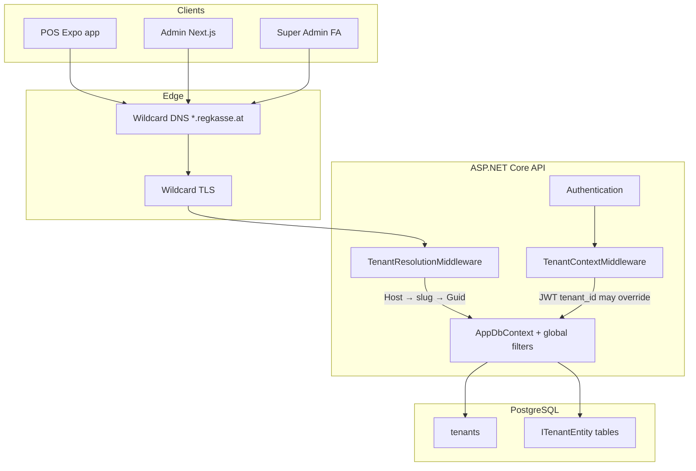
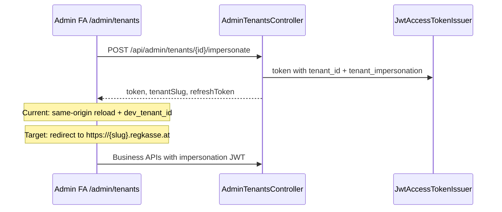

# Multi-Tenant Architecture (Regkasse)

> Authoritative overview for operators, backend developers, and admin/POS integrators.  
> Legal/compliance guarantees are **not** implied by this document.

## Table of contents

1. [Overview](#overview)
2. [Architecture diagram](#architecture-diagram)
3. [Tenant identification](#tenant-identification)
4. [Request pipeline](#request-pipeline)
5. [Data isolation](#data-isolation)
6. [Super Admin](#super-admin)
7. [Multi-tenant security](#multi-tenant-security)
8. [Setup: new tenant](#setup-new-tenant)
9. [API reference: tenant endpoints](#api-reference-tenant-endpoints)
10. [Migrating existing databases](#migrating-existing-databases)
11. [Client configuration](#client-configuration)
12. [Deployment](#deployment)
13. [Troubleshooting](#troubleshooting)
14. [Known gaps and roadmap](#known-gaps-and-roadmap)
15. [Related documentation](#related-documentation)

---

## Overview

Regkasse runs as a **single backend instance** serving many **tenants** (companies/customers). Each tenant has:

- A unique **`tenants.id`** (UUID, primary key for `tenant_id` columns)
- A unique **`tenants.slug`** (string, e.g. `cafe`, `test_cafe`) used for subdomain and dev header resolution

Production entry points:

| Host | Purpose |
|------|---------|
| `{slug}.regkasse.at` | Tenant operator / POS / tenant admin |
| `admin.regkasse.at` | Super Admin (tenant lifecycle, impersonation) |

---

## Architecture diagram



**Data flow (typical tenant request):**

```text
Host: cafe.regkasse.at
  → SubdomainTenantProvider → slug "cafe"
  → CurrentTenantService → tenants row → ICurrentTenantAccessor.TenantId = {uuid}
  → [optional] JWT tenant_id claim overrides accessor after login
  → EF queries: WHERE tenant_id = {uuid}  (ITenantEntity types)
```

---

## Tenant identification

| Environment | Resolution |
|-------------|------------|
| **Production** | First label of `Host` (`cafe.regkasse.at` → `cafe`), except `admin` / `www` → admin context |
| **Development** | Same as production **or** `X-Tenant-Id: {slug}` **or** `?tenant={slug}` |
| **Stored value** | Always **UUID** on rows; slug is only for routing |

Code:

- `backend/Tenancy/TenantHostNames.cs`
- `backend/Tenancy/SubdomainTenantProvider.cs`
- `backend/Tenancy/CurrentTenantService.cs`

**Admin host:** slug `admin` is normalized to the **legacy default tenant** (`LegacyDefaultTenantIds.PrimarySlug`) for operational APIs until Super Admin **impersonates** a target tenant.

---

## Request pipeline

Order in `ApplicationHost.cs`:

1. `TenantResolutionMiddleware` — host (or dev header/query) → slug → load tenant → set `ICurrentTenantAccessor`
2. `UseAuthentication`
3. `TenantContextMiddleware` — if JWT contains `tenant_id` claim, **override** accessor
4. `UseAuthorization` + controllers
5. `AppDbContext` — global query filters on `ITenantEntity`

---

## Data isolation

### Global query filters

All entities implementing `ITenantEntity` receive:

```text
WHERE tenant_id = @currentTenantId   -- when accessor is set
```

Implementation: `AppDbContext.CreateTenantQueryFilter<TEntity>()`.

### Cross-tenant access

- Lookup by id in another tenant’s scope → **HTTP 404** (not 403)
- Tests: `backend/KasseAPI_Final.Tests/TenantIsolationTests.cs`

### Not tenant-filtered

Examples: `tenants` table, ASP.NET Identity users, some global settings. Super Admin lists tenants via dedicated service with explicit queries (not business-table filters).

### Offline queue

`offline_transactions`:

- Column `tenant_id uuid NOT NULL`
- Set on insert from ambient tenant / owning `CashRegister`
- Preserved through replay; global filter isolates per request tenant

---

## Super Admin

### Access

- Host: **`admin.regkasse.at`**
- Role: **`SuperAdmin`** on all `/api/admin/tenants/*` endpoints

### Capabilities

| Capability | Implementation |
|------------|----------------|
| List tenants | `GET /api/admin/tenants` |
| Create tenant | `POST /api/admin/tenants` |
| Edit tenant | `PUT /api/admin/tenants/{id}` |
| Suspend / reactivate | `PUT` with `status`: `suspended` / `active` |
| Soft-delete | `DELETE /api/admin/tenants/{id}` |
| Tenant license metadata | `licenseKey`, `licenseValidUntilUtc` on tenant row |
| Issued licenses (full lifecycle) | `/api/admin/license/*` — **tenant-scoped**; use impersonation for other tenants |
| Impersonate | `POST /api/admin/tenants/{tenantId}/impersonate` |
| Cross-tenant SaaS metrics API | **Not implemented** — dashboard metrics are per-tenant context |

### Impersonation flow



**Restrictions:** cannot impersonate deleted, suspended, or inactive tenants.

**Audit:** structured logs on server; `AuditLog.impersonated_by` field **not yet** in schema.

**Admin UI:** `frontend-admin/src/app/(protected)/admin/tenants/page.tsx`  
**API client:** `frontend-admin/src/features/super-admin/api/adminTenants.ts`

---

## Multi-tenant security

### Tenant isolation guarantees

| Guarantee | Status |
|-----------|--------|
| DB-level filtering via EF global filters | ✅ |
| API clients cannot bypass filters with query params | ✅ |
| Cross-tenant IDOR returns 404 | ✅ (tested) |
| Offline queue includes `tenant_id` through replay | ✅ |
| Every business table has `tenant_id` | ⚠️ Partial — not all entities are `ITenantEntity` (e.g. `Customer`) |

### Tenant spoofing prevention

| Control | Status |
|---------|--------|
| Production: subdomain-only resolution | ✅ |
| Dev `X-Tenant-Id` / `?tenant=` disabled in Production | ✅ |
| Super Admin extra role check | ✅ |
| JWT `tenant_id` must match host subdomain in Production | ❌ **Not enforced** — see [Known gaps](#known-gaps-and-roadmap) |

---

## Setup: new tenant

### 1. Create tenant row (Super Admin)

**API:**

```bash
curl -X POST "https://admin.regkasse.at/api/admin/tenants" \
  -H "Authorization: Bearer <super-admin-jwt>" \
  -H "Content-Type: application/json" \
  -d '{
    "name": "Cafe Example",
    "slug": "cafe",
    "email": "ops@example.com"
  }'
```

**Or** use FA: `/admin/tenants` → Create.

Slug rules: lowercase alphanumeric, hyphens/underscores; must be unique.

### 2. DNS (production)

- Wildcard `*.regkasse.at` already points to API
- No per-tenant DNS record required if wildcard is in place
- Verify: `https://cafe.regkasse.at/api/health` (or your health route)

### 3. User membership

- Create or assign users with `user_tenant_memberships` for the new tenant UUID
- Login issues JWT with `tenant_id` for that tenant

### 4. License (POS)

- Issue license via admin license tools **in tenant context** (impersonate or tenant subdomain)
- POS activation: `POST /api/license/activate` → persists `tenant_id`, `tenant_slug`, `api_base_url`

### 5. Company / fiscal settings

- Configure `company_settings`, cash registers, TSE, FinanzOnline under tenant-scoped APIs
- Use tenant subdomain or impersonation JWT

### 6. Smoke test

```bash
# Development example
curl -H "X-Tenant-Id: cafe" http://localhost:5184/api/health

dotnet test backend/KasseAPI_Final.Tests/KasseAPI_Final.Tests.csproj \
  --filter "FullyQualifiedName~TenantIsolation"
```

---

## API reference: tenant endpoints

Base: `/api/admin/tenants`  
Auth: `SuperAdmin` role  
OpenAPI: `backend/swagger.json`

### `GET /api/admin/tenants`

Query: `includeDeleted` (bool, default `false`)

Response: array of `AdminTenantListItemDto` — `id`, `name`, `slug`, `email`, `phone`, `status`, `isActive`, `licenseKey`, `licenseValidUntilUtc`, `createdAt`, `updatedAt`

### `GET /api/admin/tenants/{tenantId}`

Response: `AdminTenantDetailDto` (+ `address`, `deletedAtUtc`)  
Errors: `404` tenant not found

### `POST /api/admin/tenants`

Body (`CreateAdminTenantRequest`):

| Field | Required | Notes |
|-------|----------|--------|
| `name` | yes | Display name |
| `slug` | yes | Unique subdomain key |
| `email`, `phone`, `address` | no | |
| `licenseKey`, `licenseValidUntilUtc` | no | Tenant-level license hints |

Response: `201 Created` + body; `400` if slug invalid or taken

### `PUT /api/admin/tenants/{tenantId}`

Body (`UpdateAdminTenantRequest`): partial fields including `status` (`active` | `suspended` | `deleted`), `isActive`, license fields

### `DELETE /api/admin/tenants/{tenantId}`

Soft-delete: `status=deleted`, `isActive=false`  
`400` if legacy default tenant

### `POST /api/admin/tenants/{tenantId}/impersonate`

Response (`TenantImpersonationResponseDto`):

| Field | Type | Description |
|-------|------|-------------|
| `token` | string | Access JWT |
| `expiresIn` | int | Seconds |
| `refreshToken` | string? | Refresh token |
| `refreshTokenExpiresAtUtc` | datetime? | |
| `tenantId` | uuid | Target tenant |
| `tenantSlug` | string | Subdomain slug |
| `tenantDisplayName` | string? | |
| `impersonation` | bool | Always `true` |

Errors: `404` not found; `400` suspended/deleted/inactive

JWT claims include `tenant_id` and `tenant_impersonation=true`.

---

## Migrating existing databases

### Do not use a single generic migration name

The repository applies **wave migrations**. Existing installs should run:

```bash
dotnet ef database update \
  --project backend/KasseAPI_Final.csproj \
  --startup-project backend/KasseAPI_Final.csproj
```

### Migration chain (summary)

| Migration | Purpose |
|-----------|---------|
| `20260403190133_AddTenantsAndSettingsTenantId` | `tenants` table + default tenant seed |
| `20260403203332_UserTenantMemberships` | User–tenant links |
| `20260403202249_AuthSessionTenantId` | Session tenant |
| `20260404010055_Wave2TenantScopedPaymentMethodsAndCashRegisters` | Wave 2 |
| `20260404022312_Wave3ATenantScopedCategoriesAndProducts` | Wave 3A |
| `20260404165130_Wave3BTenantScopedModifierRelations` | Wave 3B |
| `20260516101549_AddTenantIdToFiscalAndAuditTables` | Fiscal, audit, offline, invoices, … |
| `20260516104349_ExtendTenantsForSuperAdmin` | Super Admin tenant columns |

### Pattern for adding `tenant_id` to a table

1. Add column `uuid NOT NULL` with **default** `LegacyDefaultTenantIds.Primary` (Guid constant in migrations)
2. Backfill if needed (separate data migration)
3. Add FK to `tenants.id` and index
4. Map entity to `ITenantEntity` + global filter in `AppDbContext`

**Do not** use string `'legacy'` as SQL default — use the seeded default tenant **Guid**.

### New migration

```bash
dotnet ef migrations add <DescriptiveName> \
  --project backend/KasseAPI_Final.csproj \
  --startup-project backend/KasseAPI_Final.csproj
```

---

## Client configuration

### Admin (`frontend-admin`)

| Mode | Tenant source |
|------|----------------|
| Production | Subdomain of FA URL |
| Development | `HeaderDevTenantSwitch`, `X-Tenant-Id`, `localStorage.dev_tenant_id` |

Env: `NEXT_PUBLIC_API_BASE_URL` (build-time). See `frontend-admin/README.md`.

### POS (`frontend`)

| Mode | Tenant source |
|------|----------------|
| Production | License activation bootstrap (`tenantStorage`) |
| Development | `EXPO_PUBLIC_DEV_TENANT_ID`, `DevTenantSwitcher` |

See `REGKASSE_AI_ONBOARDING.md` → POS Tenant Configuration.

---

## Deployment

### DNS

- Wildcard **A** / **AAAA**: `*.regkasse.at` → API load balancer
- Apex / `admin` as required by your DNS provider

### TLS

- Certificate must cover `*.regkasse.at` (and apex if used)

### Proxy

- Forward **`Host`** header unchanged (required for slug resolution)

### Environment

| Variable | Value | Effect |
|----------|-------|--------|
| `ASPNETCORE_ENVIRONMENT` | `Production` | No `X-Tenant-Id` / `?tenant=` overrides |
| `ASPNETCORE_ENVIRONMENT` | `Development` | Dev header/query enabled |

---

## Troubleshooting

### Wrong tenant data visible

| Symptom | Check |
|---------|--------|
| Sees another tenant’s rows | JWT `tenant_id` vs host slug; dev header stale in `localStorage` |
| Empty lists | Accessor tenant UUID mismatch; missing `tenants` row for slug |
| Super Admin sees only default tenant data | Expected until impersonation; use impersonate API |

**Fix (dev):** clear `dev_tenant_id`, re-select tenant in FA header switcher, re-login.

### `404` on valid id

Often **correct isolation** — id belongs to another tenant. Verify `tenant_id` on row with `IgnoreQueryFilters()` in admin tooling only.

### Impersonation fails with `400`

Tenant may be `suspended`, `deleted`, or `isActive=false`. Check `GET /api/admin/tenants/{id}`.

### Subdomain does not resolve tenant

| Check | Action |
|-------|--------|
| `tenants.slug` matches host first label | `test-cafe.localhost` → slug `test-cafe`, not `test_cafe` |
| Hosts file for `*.regkasse.local` | Use `cafe.regkasse.local` or dev header |
| `admin` host | Maps to legacy default tenant, not “all tenants” |

### CORS errors with `*.localhost` API host

`*.localhost` is not in `IsLocalDevelopmentDomain`. Prefer `localhost:5184` + `X-Tenant-Id` for browser API tests.

### Migration fails on `tenant_id`

- Ensure `tenants` seed migration ran first
- Check FK conflicts before NOT NULL without default
- Review `backend/Migrations/` for wave order

### Tests

```bash
dotnet test backend/KasseAPI_Final.Tests/KasseAPI_Final.Tests.csproj \
  --filter "FullyQualifiedName~TenantIsolation"
```

---

## Known gaps and roadmap

| Item | Status |
|------|--------|
| Production impersonation redirect to `{slug}.regkasse.at` | Not implemented in FA |
| `AuditLog.impersonated_by` (or metadata) for impersonation | Not implemented |
| JWT `tenant_id` ↔ host subdomain enforcement middleware | Not implemented |
| Cross-tenant SaaS metrics API | Not implemented |
| All domain entities on `ITenantEntity` | Incomplete (e.g. `Customer`) |

When implementing security middleware, add tests to `TenantIsolationTests` and update this section.

---

## Related documentation

| Document | Content |
|----------|---------|
| `REGKASSE_AI_ONBOARDING.md` | AI brief, dev setup, API headers |
| `AGENTS.md` | Agent rules, multi-tenant summary |
| `backend/README.md` | Backend quick start, middleware paths |
| `frontend-admin/README.md` | Admin setup, Super Admin UI |
| `frontend-admin/docs/api-contract.md` | Admin API modules + tenant reference |
| `ai/02_DATABASE_CONTRACT.md` | Schema + migration waves |
| `ai/05_SECURITY_COMPLIANCE.md` | Security guarantees (Turkish) |
| `ai/01_BACKEND_CONTRACT.md` | Backend contract summary |
