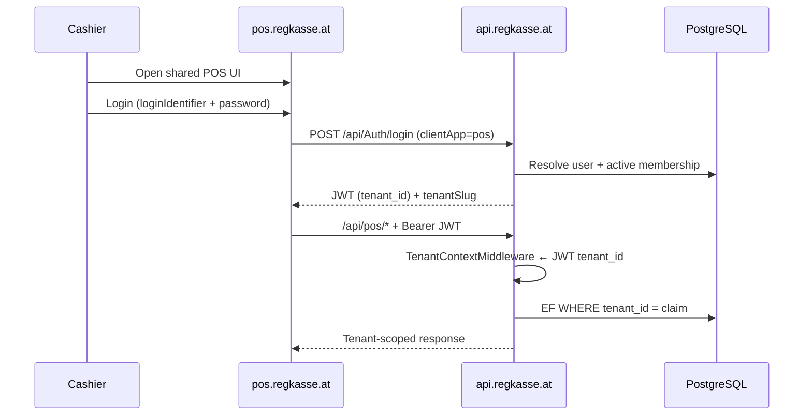

# POS Production Architecture — Single POS UI

> **Status:** Target architecture (decision recorded 2026-07-16)  
> **Source of truth for agents:** `AGENTS.md` (summary) · this doc (detail) · `docs/MULTI_TENANT.md` (isolation & pipeline)

## Decision: Single POS UI

All tenants share **one** POS application deployment. Tenant identity is **not** derived from a per-tenant subdomain for POS. After login, the JWT `tenant_id` claim is the production tenant boundary.

| Goal | Result |
|------|--------|
| One POS binary / web build for every mandant | ✅ |
| Tenant isolation | ✅ JWT + EF global filters |
| Ops / release management | ✅ Single POS host |
| Consistent cashier UX | ✅ Same UI for all tenants |

---

## 1. Production URLs

```text
POS UI:     https://pos.regkasse.at
FA UI:      https://admin.regkasse.at
API:        https://api.regkasse.at
```

| Surface | Host | Role |
|---------|------|------|
| **POS** | `pos.regkasse.at` | Shared Expo/web POS for all tenants |
| **FA** | `admin.regkasse.at` | Admin panel (Super Admin + mandant admin session) |
| **API** | `api.regkasse.at` | Shared ASP.NET Core API |

**Reserved host labels** (must never be treated as tenant slugs): `pos`, `api`, `admin`, `www`.

**Not used for POS:** `https://{slug}.regkasse.at` as the POS entry point.

**Customer websites (not POS):** Shared Next app [`frontend-sites`](../frontend-sites/README.md) serves `/[slug]` storefronts and online-order UI. Optional custom Host → slug via verified `TenantDomain`. See [`DIGITAL_SERVICES.md`](DIGITAL_SERVICES.md) / [`WORKING_HOURS.md`](WORKING_HOURS.md).

---

## 2. Tenant resolution (POS)

```text
POS Login → User signs in (loginIdentifier + password)
         → Auth resolves active tenant membership
         → JWT issued with tenant_id (+ tenant_slug claims as needed)
         → All subsequent /api/pos/* calls scoped by JWT tenant_id
         → EF global filters enforce same-tenant rows only
         → Cross-tenant IDOR → HTTP 404
```

### Rules

1. **Pre-login / public:** Ambient host `pos` / `api` is **not** a tenant. Login uses membership resolution (`ResolveLoginTenantAccessAsync`), not Host slug.
2. **Post-login:** `ICurrentTenantAccessor.TenantId` comes from JWT `tenant_id` (`TenantContextMiddleware`). That Guid is the only production tenant key for POS API traffic.
3. **POS must not** send production `X-Tenant-Id` or `?tenant=` — those exist only in Development.
4. **Cashier sees only their mandant** — membership + JWT; never another tenant’s data.

### Sequence



---

## 3. Development URLs

```text
POS UI:     http://localhost:8081
FA UI:      http://admin.regkasse.local:3000
API:        http://localhost:5184
```

| Surface | URL | Notes |
|---------|-----|--------|
| POS | `http://localhost:8081` | Expo Metro / web |
| FA | `http://admin.regkasse.local:3000` | Hosts-file friendly admin origin |
| API | `http://localhost:5184` | Dev Kestrel; `X-Tenant-Id` / `?tenant=` allowed |

---

## 4. Tenant testing (dev)

```text
POS: EXPO_PUBLIC_DEV_TENANT_ID + DevTenantSwitcher
FA:  Header tenant switcher (dev_tenant_id → X-Tenant-Id)
```

| Client | How to pick tenant before / around login |
|--------|------------------------------------------|
| **POS** | `EXPO_PUBLIC_DEV_TENANT_ID` (default `dev`) and in-app **DevTenantSwitcher**; axios adds `X-Tenant-Id` + optional `?tenant=` in `__DEV__` |
| **FA** | Header **tenant switcher** → `localStorage.dev_tenant_id` → `X-Tenant-Id` on API calls |

After login in either client, **JWT `tenant_id` overrides** ambient/dev header for authenticated APIs.

Quick checks:

```bash
curl -H "X-Tenant-Id: dev" http://localhost:5184/api/health
curl "http://localhost:5184/api/health?tenant=dev"
```

---

## 5. API & client contracts

| Client | Allowed API prefix | Tenant in production |
|--------|--------------------|----------------------|
| POS | `/api/pos/*`, `/api/Auth/*`, shared fiscal as today | JWT `tenant_id` |
| FA | `/api/admin/*`, `/api/Auth/*` | JWT `tenant_id` (Super Admin: impersonation for mandant data) |

POS production env (illustrative):

```env
EXPO_PUBLIC_API_BASE_URL=https://api.regkasse.at/api
```

Do **not** bake per-tenant API hosts into POS builds.

---

## 6. Relation to legacy subdomain model

| Concern | Legacy / transition | Target (this decision) |
|---------|---------------------|-------------------------|
| POS entry | `{slug}.regkasse.at` or license `apiBaseUrl` per tenant | `pos.regkasse.at` only |
| API host | Often same as tenant subdomain | `api.regkasse.at` |
| Tenant from Host | First label = slug | Reserved `pos` / `api` / `admin` ≠ tenant |
| Isolation | Host + JWT | **JWT + EF filters** (authoritative) |

Backend still has `SubdomainTenantProvider` for hosts where the first label **is** a tenant slug (e.g. historical `{slug}.*`, local `dev.regkasse.local`). Production POS/API reserved hosts must resolve ambient tenant only via **JWT after auth**, not via the label `pos` / `api`.

---

## 7. Implementation checklist (gaps)

Track until done; keep `docs/MULTI_TENANT.md` Known gaps in sync.

**Done in code / docs**
- [x] Treat `pos` and `api` as reserved in `TenantHostNames` (same class as `admin` / `www`)
- [x] Document single POS UI + JWT tenant (this doc, `AGENTS.md`, `MULTI_TENANT.md`)
- [x] Clarify customer websites are `frontend-sites`, not POS slug hosts

**Deploy / product follow-ups**
- [ ] POS production build: fixed `EXPO_PUBLIC_API_BASE_URL=https://api.regkasse.at/api`
- [ ] Stop requiring per-tenant `apiBaseUrl` for normal POS login (license bootstrap optional for device binding only)
- [ ] Production: authenticated POS/API requests require JWT tenant; reject spoofed tenant headers
- [ ] DNS + TLS: `pos.regkasse.at`, `admin.regkasse.at`, `api.regkasse.at` (+ keep `*.regkasse.at` if legacy hosts remain)
- [ ] Retire FA impersonation flows that still assume `{slug}.regkasse.at` for POS entry (prefer FA session handoff)

---

## 8. Related documentation

| Document | Role |
|----------|------|
| `AGENTS.md` | Always-applied agent summary |
| `docs/MULTI_TENANT.md` | Isolation, middleware, security |
| `docs/DIGITAL_SERVICES.md` | Tenant websites / apps (not POS) |
| `frontend-sites/README.md` | Shared storefront runtime |
| `REGKASSE_AI_ONBOARDING.md` | Dev setup, POS tenant config |
| `ai/01_BACKEND_CONTRACT.md` | Backend tenancy contract |
| `ai/04_FRONTEND_CONTRACT.md` | POS/FA client contract |
| `docs/IMPERSONATION_FLOW.md` | Super Admin → mandant session |
| `docs/README.md` | Documentation index |
