# Scripts ecosystem map

> **Last updated:** 2026-08-01  
> Visual guide: which Windows `.bat` to use for which task.  
> Full detail: [`SCRIPTS_REFERENCE.md`](SCRIPTS_REFERENCE.md) · Pocket card: [`SCRIPTS_QUICK_REF.md`](SCRIPTS_QUICK_REF.md) · Test plan: [`SCRIPTS_TEST_PLAN.md`](SCRIPTS_TEST_PLAN.md)

All entry points live under `scripts/<category>/` (repo root has no `.bat` files).

---

## Decision flowchart

```mermaid
flowchart TD
    A[You want to...] --> B{What do you want to do?}

    B -->|Develop| C[Development Scripts]
    B -->|Use Docker| D[Docker Scripts]
    B -->|Maintain| E[Maintenance Scripts]
    B -->|Deploy / validate stack| F[Deployment Scripts]
    B -->|Debug / CI gates| G[Helpers]

    C --> C1[scripts/dev/start-dev.bat]
    C --> C2[scripts/dev/start-backend.bat]
    C --> C3[scripts/dev/start-admin.bat]
    C --> C4[scripts/dev/start-pos.bat]
    C --> C5[scripts/dev/start-sites.bat]
    C --> C6[scripts/test/test-all.bat]
    C --> C7[scripts/dev/clean-all.DANGER.bat]

    D --> D1[scripts/docker/host/up.bat]
    D --> D2[scripts/docker/host/down.bat]
    D --> D3[scripts/docker/host/clean.DANGER.bat]
    D --> D4[scripts/docker/host/status.bat]

    E --> E1[scripts/dev/clean-backend.bat]
    E --> E2[scripts/dev/dev-purge-tenant.DANGER.bat]
    E --> E3[scripts/rksv/generate-dep-export.bat]
    E --> E4[scripts/rksv/ensure-bmf-prueftool.bat]
    E --> E5[scripts/dev/fix-antd.bat]
    E --> E6[scripts/dev/dev-mail.bat]
    E --> E7[scripts/test/smoke-test.bat]

    F --> F1[scripts/ops/deploy.DANGER.bat]
    F --> F2[scripts/ops/rollback.DANGER.bat]

    G --> G1[scripts/lib/run-with-log.bat]
    G --> G2[scripts/lib/validate-scripts.bat]
    G --> G3[scripts/test/test-scripts.bat]
    G --> G4[scripts/lib/create-bat-wrappers.bat]

    C1 --> N1["npm run dev"]
    D1 --> N2["docker compose up -d"]
    F1 --> N3["prod compose + smoke + backup gate"]
    F2 --> N4["git reset --hard HEAD~1 + prod rebuild"]
```

> **Note:** `scripts\ops\deploy.DANGER.bat` uses `docker-compose.prod.yml` with confirmations. Prefer `git revert` over `rollback.bat` on shared branches. `scripts\test\smoke-test.bat` is lightweight curl; full suite is `scripts\test\run-comprehensive-smoke.bat`.

---

## Category → script → when

| Category | Script | When |
|----------|--------|------|
| Development | [`scripts/dev/start-dev.bat`](../scripts/dev/start-dev.bat) | Daily full stack |
| Development | [`scripts/dev/start-backend.bat`](../scripts/dev/start-backend.bat) | API only |
| Development | [`scripts/dev/start-admin.bat`](../scripts/dev/start-admin.bat) | FA only |
| Development | [`scripts/dev/start-pos.bat`](../scripts/dev/start-pos.bat) | POS only |
| Development | [`scripts/dev/start-sites.bat`](../scripts/dev/start-sites.bat) | Tenant Sites only |
| Development | [`scripts/test/test-all.bat`](../scripts/test/test-all.bat) | Before commit |
| Development | [`scripts/dev/clean-all.DANGER.bat`](../scripts/dev/clean-all.DANGER.bat) | Stale build artifacts |
| Docker | [`scripts/docker/host/up.bat`](../scripts/docker/host/up.bat) | Start Compose |
| Docker | [`scripts/docker/host/down.bat`](../scripts/docker/host/down.bat) | Stop Compose |
| Docker | [`scripts/docker/host/status.bat`](../scripts/docker/host/status.bat) | Is it up? |
| Docker | [`scripts/docker/host/clean.DANGER.bat`](../scripts/docker/host/clean.DANGER.bat) | Wipe volumes (**data loss**) |
| Maintenance | [`scripts/dev/clean-backend.bat`](../scripts/dev/clean-backend.bat) | Corrupted `bin`/`obj` |
| Maintenance | [`scripts/dev/dev-purge-tenant.DANGER.bat`](../scripts/dev/dev-purge-tenant.DANGER.bat) | Dev catalog reset |
| Maintenance | [`scripts/rksv/generate-dep-export.bat`](../scripts/rksv/generate-dep-export.bat) | DEP fixtures |
| Maintenance | [`scripts/rksv/ensure-bmf-prueftool.bat`](../scripts/rksv/ensure-bmf-prueftool.bat) | Prüftool JARs |
| Maintenance | [`scripts/dev/fix-antd.bat`](../scripts/dev/fix-antd.bat) | Ant Design 6 fixes |
| Maintenance | [`scripts/dev/dev-mail.bat`](../scripts/dev/dev-mail.bat) | Local mail capture |
| Maintenance | [`scripts/test/smoke-test.bat`](../scripts/test/smoke-test.bat) | Lightweight curl smoke |
| Deployment | [`scripts/ops/deploy.DANGER.bat`](../scripts/ops/deploy.DANGER.bat) | Prod Compose + smoke + backup gate |
| Deployment | [`scripts/ops/rollback.DANGER.bat`](../scripts/ops/rollback.DANGER.bat) | Discard last commit + rebuild |
| Helpers | [`scripts/lib/run-with-log.bat`](../scripts/lib/run-with-log.bat) | Log any command |
| Helpers | [`scripts/lib/validate-scripts.bat`](../scripts/lib/validate-scripts.bat) | Pairing + docs CI gate |
| Helpers | [`scripts/test/test-scripts.bat`](../scripts/test/test-scripts.bat) | Dry-run bat structure |
| Helpers | [`scripts/lib/create-bat-wrappers.bat`](../scripts/lib/create-bat-wrappers.bat) | Generate missing `.bat` |

Mode chooser: [`scripts/dev/start.bat`](../scripts/dev/start.bat). Comparison: [`DOCKER_VS_LEGACY.md`](DOCKER_VS_LEGACY.md).
