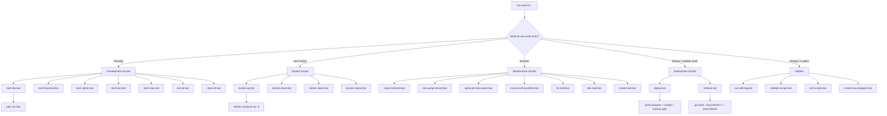
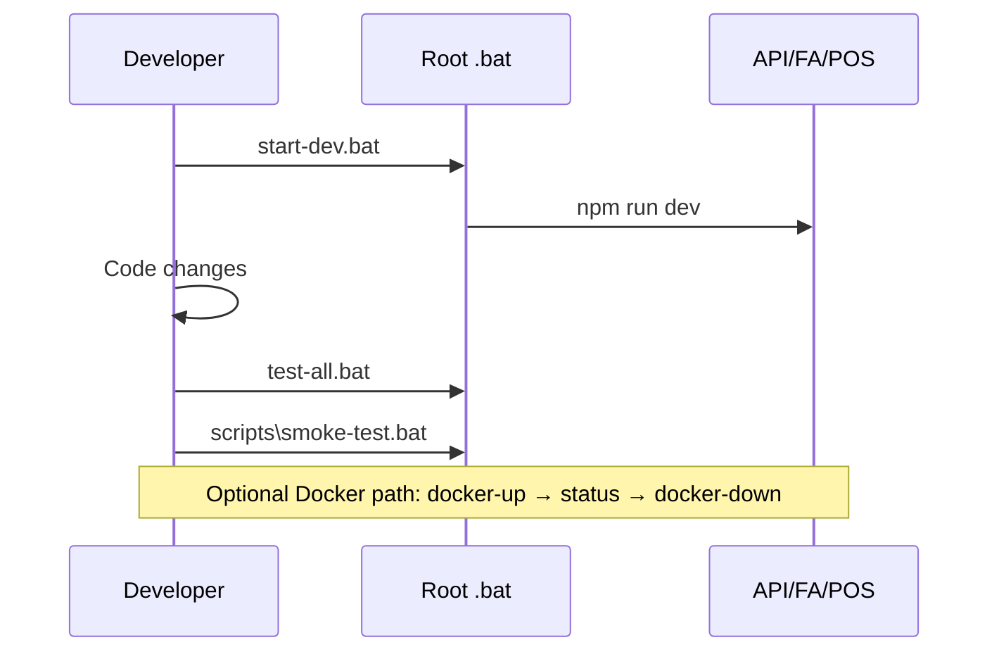

# Scripts ecosystem map

> **Last updated:** 2026-07-29  
> Visual guide: which Windows `.bat` to use for which task.  
> Full detail: [`SCRIPTS_REFERENCE.md`](SCRIPTS_REFERENCE.md) · Pocket card: [`SCRIPTS_QUICK_REF.md`](SCRIPTS_QUICK_REF.md) · Test plan: [`SCRIPTS_TEST_PLAN.md`](SCRIPTS_TEST_PLAN.md)

---

## Decision flowchart

> **Note:** `deploy.bat` uses `docker-compose.prod.yml` with confirmations (operator checklist on the deploy host). It is **not** a substitute for GitHub Actions cloud CD alone. Prefer `git revert` over `rollback.bat` on shared branches. `scripts\smoke-test.bat` is lightweight curl; full suite is `run-comprehensive-smoke.bat`.

---

## Category → script → when

| Category | Script | When |
|----------|--------|------|
| Development | [`start-dev.bat`](../start-dev.bat) | Daily full stack |
| Development | [`start-backend.bat`](../start-backend.bat) | API only |
| Development | [`start-admin.bat`](../start-admin.bat) | FA only |
| Development | [`start-pos.bat`](../start-pos.bat) | POS only |
| Development | [`start-sites.bat`](../start-sites.bat) | Tenant Sites only |
| Development | [`test-all.bat`](../test-all.bat) | Before commit |
| Development | [`clean-all.bat`](../clean-all.bat) | Stale build artifacts |
| Docker | [`docker-up.bat`](../docker-up.bat) | Start Compose |
| Docker | [`docker-down.bat`](../docker-down.bat) | Stop Compose |
| Docker | [`docker-status.bat`](../docker-status.bat) | Is it up? |
| Docker | [`docker-clean.bat`](../docker-clean.bat) | Wipe volumes (**data loss**) |
| Maintenance | [`scripts/clean-backend.bat`](../scripts/clean-backend.bat) | Corrupted `bin`/`obj` |
| Maintenance | [`scripts/dev-purge-tenant.bat`](../scripts/dev-purge-tenant.bat) | Dev catalog reset |
| Maintenance | [`scripts/generate-dep-export.bat`](../scripts/generate-dep-export.bat) | DEP fixtures |
| Maintenance | [`scripts/ensure-bmf-prueftool.bat`](../scripts/ensure-bmf-prueftool.bat) | Prüftool JARs |
| Maintenance | [`scripts/fix-antd.bat`](../scripts/fix-antd.bat) | Ant Design 6 fixes |
| Maintenance | [`scripts/dev-mail.bat`](../scripts/dev-mail.bat) | Local mail capture |
| Maintenance | [`scripts/smoke-test.bat`](../scripts/smoke-test.bat) | Lightweight curl smoke (stack up) |
| Deployment | [`deploy.bat`](../deploy.bat) | Prod Compose + smoke + backup gate |
| Deployment | [`rollback.bat`](../rollback.bat) | Discard last commit + rebuild |
| Helpers | [`scripts/run-with-log.bat`](../scripts/run-with-log.bat) | Log any command |
| Helpers | [`scripts/validate-scripts.bat`](../scripts/validate-scripts.bat) | Pairing + docs CI gate |
| Helpers | [`scripts/test-scripts.bat`](../scripts/test-scripts.bat) | Dry-run bat structure |
| Helpers | [`scripts/create-bat-wrappers.bat`](../scripts/create-bat-wrappers.bat) | Generate missing `.bat` |

Anchors for deep links in GitHub / VS Code preview: see headings under [`SCRIPTS_REFERENCE.md`](SCRIPTS_REFERENCE.md) (e.g. `#start-devbat`, `#docker-upbat`, `#deploybat`).

---

## Typical day

---

## Related

| Doc | Purpose |
|-----|---------|
| [`SCRIPTS_QUICK_REF.md`](SCRIPTS_QUICK_REF.md) | One-screen icon card |
| [`SCRIPTS_REFERENCE.md`](SCRIPTS_REFERENCE.md) | Full reference |
| [`SCRIPTS_TEST_PLAN.md`](SCRIPTS_TEST_PLAN.md) | Automated + manual tests |
| [`BATCH_FILES.md`](BATCH_FILES.md) | Short inventory |
| [`../scripts/README.md`](../scripts/README.md) | Folder conventions |
