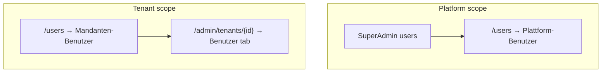

# User management (platform vs tenant)

> **Audience:** Super Admin, tenant Managers, FA maintainers.  
> **UI:** German (de-AT). **Technical:** English.

Explains **platform users** vs **tenant (Mandant) users**, **direct user creation** (no invitation emails), password handoff, reset, and remove-vs-delete semantics.

Related: [`TENANT_MANAGEMENT.md`](TENANT_MANAGEMENT.md), [`CUSTOMER_ONBOARDING.md`](CUSTOMER_ONBOARDING.md), [`API_CONTRACTS.md`](API_CONTRACTS.md) (login `loginIdentifier`, `userName`, Quick Create API).

---

## Two scopes



| Scope | German (UI) | Who manages | Tenant context |
|-------|-------------|-------------|----------------|
| **Platform** | Plattform-Benutzer | Super Admin only | None (`admin.regkasse.at`) |
| **Tenant** | Mandanten-Benutzer | Super Admin (any tenant) or Manager (own tenant) | Fixed by host / impersonation / membership |

**Code helper:** `isPlatformUserRole()` — only `SuperAdmin` is treated as a platform operator role (`frontend-admin/src/features/users/utils/userScope.ts`).

---

## Roles and permissions (summary)

| Role (EN) | Typical use | Tenant membership |
|-----------|-------------|-------------------|
| **SuperAdmin** | Regkasse operations, tenant lifecycle | Platform; not business staff |
| **Manager** | Tenant admin, settings, users, reports | Required |
| **Cashier** | POS / payments | Required |
| **Accountant** | Reports, exports | Required |
| **Waiter / Kitchen** | POS workflows (where enabled) | Optional per deployment |

Authorization is **permission-first** on the API (`[HasPermission(AppPermissions.UserManage)]`); FA gates menus via `usersPolicy` and role checks.

**Tenant create roles:** `Manager`, `Cashier`, `Accountant`, `Waiter`, `Kitchen` — `TENANT_CREATE_ROLES` in FA.

---

## Routes and UI surfaces

### Access & roles hub (tenant Manager / Super Admin)

Since 2026-06, operational RBAC is grouped under **Verwaltung → Zugriff & Rollen**:

| Route | German (nav) | Notes |
|-------|--------------|-------|
| `/admin/access` | Übersicht | Hub landing cards |
| `/admin/users` | Benutzer | Tenant user list + lifecycle (Manager); Super Admin uses unified view at `/users` → `/admin/users` |
| `/admin/access/roles` | Rollen & Berechtigungen | Full-page role + permission editor |
| `/admin/access/matrix` | Berechtigungsübersicht | Read-only matrix |

Technical reference: [`frontend-admin/docs/ACCESS_AND_ROLES_HUB.md`](../frontend-admin/docs/ACCESS_AND_ROLES_HUB.md).

Admin JWT/`/me` permissions are filtered for FA via `AdminAppPermissionProfile` (Cashier admin whitelist; Manager without POS-terminal keys). Menu visibility contract: `npm run test:contract` in `frontend-admin`.

### Legacy / other surfaces

| Surface | Route | Component |
|---------|-------|-----------|
| Combined users page | `/users` or `/admin/users` | `UnifiedAdminUsersView` (Super Admin), tenant list (Manager) |
| Tenant detail users | `/admin/tenants/{tenantId}` → Benutzer | `TenantUsersTabCore`, `TenantDetailUsersTab` |
| Create user modal | (modal) | `CreateUserModal` — form + one-time password modal |
| Add existing user | (modal, tenant detail) | `AddExistingUserModal` |
| Platform users API | `POST /api/admin/users` | `createPlatformUser` / `createUser` |
| Tenant users API | `POST /api/admin/tenants/{tenantId}/users` | `createTenantUser` / `createUser` |

  


---

## How to create users

There is **no invitation email flow**. Administrators create users directly; the API returns a **one-time generated password** for secure handoff outside the product.

### Super Admin — new tenant user

1. Open `/admin/tenants/{tenantId}` → tab **Benutzer**, or `/users` → **Benutzer anlegen**
2. **Benutzer anlegen** → `CreateUserModal`
3. Enter **E-Mail**, optional **Vorname** / **Nachname**, **Rolle**, optional **Mandanten-Administrator (Owner)**
4. Submit → `POST /api/admin/tenants/{tenantId}/users` (or `POST /api/admin/users` with `tenantId` in body)

Backend (`TenantUserService.CreateAsync`):

- Creates Identity user + `user_tenant_memberships` + ASP.NET role
- Generates compliant password server-side (`PasswordGenerator.GenerateSecurePassword`)
- Sets `MustChangePasswordOnNextLogin = true`
- Audit: `USER_CREATED` with metadata `createdByUserId`, `tenantId`, `role` — **password is never logged**

### Super Admin — platform user

1. `POST /api/admin/users` without `tenantId` — email + role (e.g. `SuperAdmin`)
2. Response: `AdminCreateUserResponseDto` with `generatedPassword` (shown once in FA)

### Tenant Admin (Manager) — fixed tenant

1. Open `/users` on tenant host (`{slug}.regkasse.at`)
2. **Benutzer anlegen** — same modal; tenant is implicit from JWT (no mandant picker)
3. Cannot create users for other tenants

### Frontend mutation pattern

```typescript
// src/features/users/api/users.ts + hooks/useCreateUser.ts
createUser({ email, firstName, lastName, role, isOwner?, tenantId? });
// tenantId set → createTenantUser; omitted → createPlatformUser
```

`CreateUserModal` shows the generated password in a second modal (copy + warning).

---

## Add existing user (no new Identity row)

**Bestehenden Benutzer hinzufügen** → `AddExistingUserModal` → `POST /api/admin/tenants/{tenantId}/users/assign` with existing `userId`.

Use when the person already has an account (e.g. works at another mandant). Does **not** issue a new password or send email.

---

## Password management

### Password generation policy

- Server-side: `PasswordGenerator.GenerateSecurePassword` (min 12 chars; upper, lower, digit, special from `!@#$%^&*()`).
- Returned **once** in API response (`generatedPassword` / `CreateUserResult`).
- **Never** written to audit log metadata or application logs.

### First login — force change

- `MustChangePasswordOnNextLogin = true` on create and on admin reset.
- User must set a new password at next login (German UI messaging in FA).

### Reset password flow (no email)

| Feature | Behavior |
|---------|----------|
| **Reset password** (tenant tab) | `ResetPasswordModal` → admin reset endpoint → new one-time password in modal |
| **Force change** | Same flag as create; operator delivers password securely |
| **Onboarding admin** | Provisioning wizard still may use welcome email (`WelcomeEmailService`) — separate from day-to-day user create |

SMTP is **not** required for tenant user creation or password reset. Optional `Email:Smtp` remains only for **tenant onboarding welcome** mail (see [`CUSTOMER_ONBOARDING.md`](CUSTOMER_ONBOARDING.md)).

---

## Remove from tenant vs delete user

| Action (DE) | API | Effect |
|-------------|-----|--------|
| **Zuweisung entfernen** / **Entfernen** | `DELETE /api/admin/tenants/{tenantId}/users/{userId}` | Removes **membership**; Identity user may remain for other tenants |
| **Benutzer deaktivieren** (global) | Deactivate on `/users` | `IsActive=false`; login blocked platform-wide |
| **Plattform-Benutzer anlegen** | `POST /api/admin/users` (no `tenantId`) | Super Admin staff only |

**Important:** Removing a user from a tenant is **not** the same as deleting the Identity account.

**Owner:** At most one active **Owner** per tenant (`is_owner=true` on `user_tenant_memberships`). Drives switcher 🟢/🟡 status.

---

## Super Admin vs Manager capabilities

| Action | Super Admin | Manager (tenant) |
|--------|-------------|------------------|
| List platform users | ✅ | ❌ |
| Create user in any tenant | ✅ | Own tenant only |
| Add existing user to tenant | ✅ | Own tenant (if permitted) |
| Set tenant owner | ✅ | Policy-dependent |
| Reset tenant user password | ✅ | Own tenant (if permitted) |
| Role management drawer | ✅ (global roles) | Limited |

---

## Removed (2026-05-22)

| Removed | Replacement |
|---------|-------------|
| `POST /api/admin/users/invite` | `POST /api/admin/users` (+ `tenantId` for mandant users) |
| `POST /api/admin/tenants/{id}/users/invite` | `POST /api/admin/tenants/{id}/users` |
| `TenantInvitationEmailSender` / invitation SMTP for users | One-time password in UI |
| FA invite acceptance route `/invite/accept` | N/A — direct create only |
| `InviteUserModal` | `CreateUserModal` |

---

## Key files

| Area | Path |
|------|------|
| Users page | `frontend-admin/src/app/(protected)/users/page.tsx` |
| Unified view | `frontend-admin/src/features/users/components/UnifiedAdminUsersView.tsx` |
| Create modal | `frontend-admin/src/features/users/components/CreateUserModal.tsx` |
| Add existing | `frontend-admin/src/features/super-admin/components/AddExistingUserModal.tsx` |
| API + hook | `frontend-admin/src/features/users/api/users.ts`, `hooks/useCreateUser.ts` |
| Tenant users API | `frontend-admin/src/features/super-admin/api/tenantUsers.ts` |
| Backend | `backend/Services/AdminTenants/TenantUserService.cs`, `Controllers/AdminUsersController.cs` |
| Audit metadata | `backend/Services/UserCreatedAuditDetails.cs` |
| i18n (DE) | `frontend-admin/src/i18n/locales/de/users.json`, `tenants.json` |

---

## Screenshots

Suggested paths under `docs/images/user-management/`:

| File | Content |
|------|---------|
| `fa-users-platform.png` | `/users` → Plattform-Benutzer |
| `fa-tenant-users.png` | Mandanten-Benutzer or tenant detail users tab |
| `fa-create-user.png` | Create user modal + one-time password modal |
