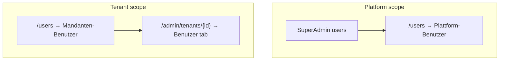

# User management (platform vs tenant)

> **Audience:** Super Admin, tenant Managers, FA maintainers.  
> **UI:** German (de-AT). **Technical:** English.

Explains **platform users** vs **tenant (Mandant) users**, roles, invitations, password reset, and remove-vs-delete semantics.

Related: [`TENANT_MANAGEMENT.md`](TENANT_MANAGEMENT.md), [`CUSTOMER_ONBOARDING.md`](CUSTOMER_ONBOARDING.md).

---

## Two scopes



| Scope | German (UI) | Who manages | Tenant context |
|-------|-------------|-------------|----------------|
| **Platform** | Plattform-Benutzer | Super Admin only | None (`admin.regkasse.at`) |
| **Tenant** | Mandanten-Benutzer | Super Admin (any tenant) or Manager (own tenant) | Fixed by host / impersonation / membership |

**Code helper:** `isPlatformUserRole()` — only `SuperAdmin` is treated as a platform operator role (`frontend-admin/src/features/users/utils/userScope.ts`).

---

## Roles and permissions (summary)

| Role (EN) | Typical use | Tenant membership |
|-----------|-------------|-------------------|
| **SuperAdmin** | Regkasse operations, tenant lifecycle | Platform; not business staff |
| **Manager** | Tenant admin, settings, users, reports | Required |
| **Cashier** | POS / payments | Required |
| **Accountant** | Reports, exports | Required |
| **Waiter / Kitchen** | POS workflows (where enabled) | Optional per deployment |

Authorization is **permission-first** on the API (`[HasPermission(...)]`); FA gates menus via `usersPolicy` and role checks.

**Invite roles (tenant):** `Manager`, `Cashier`, `Accountant` — constant `INVITE_TENANT_ROLES` in Super Admin tenant users UI.

---

## Routes and UI surfaces

| Surface | Route | Component |
|---------|-------|-----------|
| Combined users page | `/users` | `users/page.tsx` — tabs **Plattform** / **Mandant** / invitations |
| Tenant-only (Super Admin) | `/admin/tenants/{tenantId}/users` | `TenantDetailUsersTab` |
| Platform users API | `/api/admin/platform-users` (see `createPlatformUser`) | `PlatformUsersTab` |
| Tenant users API | `/api/admin/tenants/{tenantId}/users/*` | `tenantUsers.ts` |

  


---

## How to invite users

### Super Admin — select tenant

1. Open `/admin/tenants/{tenantId}` → tab **Benutzer**, or `/admin/tenants/{tenantId}/users`
2. **Benutzer einladen** → `InviteUserModal`
3. Enter **E-Mail**, **Rolle**, optional **Mandanten-Administrator (Owner)**
4. Submit → `POST /api/admin/tenants/{tenantId}/users/invite`

Backend (`TenantUserService`):

- If account missing → create Identity user + membership
- If account exists → add membership only
- If SMTP configured → invitation email; else one-time password in modal (DE hint)

### Tenant Admin (Manager) — fixed tenant

1. Open `/users` on tenant host (`{slug}.regkasse.at`) or while impersonating
2. Tab **Mandanten-Benutzer** → same invite patterns scoped to **current tenant JWT**
3. Cannot assign users to other tenants

### Add existing user (no new Identity row)

**Bestehenden Benutzer hinzufügen** → `AddExistingUserModal` → `POST …/users` with existing `userId`.

---

## Password reset and first login

| Feature | Behavior |
|---------|----------|
| **Reset password** (tenant tab) | `ResetPasswordModal` → generates compliant one-time password |
| **Send email** | Checkbox when SMTP configured (`TenantInvitationEmailSender` / same `Email:Smtp` section) |
| **Force change** | `MustChangePasswordOnNextLogin` set on invite, reset, and onboarding admin |
| **Onboarding admin** | Always force change; password shown once in `OnboardingSuccessModal` |

German hint: *„Der Benutzer muss sich beim nächsten Login anmelden und das Passwort ändern.“*

Without SMTP: password displayed once in UI; operator must deliver securely.

---

## Remove from tenant vs delete user

| Action (DE) | API | Effect |
|-------------|-----|--------|
| **Zuweisung entfernen** / **Entfernen** | `DELETE /api/admin/tenants/{tenantId}/users/{userId}` | Removes **membership**; Identity user may remain for other tenants |
| **Benutzer deaktivieren** (global) | Deactivate on `/users` | `IsActive=false`; login blocked platform-wide |
| **Plattform-Benutzer anlegen** | Platform create endpoint | Super Admin staff only |

**Important:** Removing a user from a tenant is **not** the same as deleting the Identity account. Deletion is restricted and may fail if audit/history requires retention.

**Owner:** At most one active **Owner** per tenant (`is_owner=true` on `user_tenant_memberships`). Setting owner updates support visibility (🟢/🟡) in tenant switcher.

---

## Super Admin vs Manager capabilities

| Action | Super Admin | Manager (tenant) |
|--------|-------------|------------------|
| List platform users | ✅ | ❌ |
| Invite to any tenant | ✅ | Own tenant only |
| Set tenant owner | ✅ | Policy-dependent |
| Reset tenant user password | ✅ | Own tenant (if permitted) |
| Role management drawer | ✅ (global roles) | Limited |

---

## SMTP configuration (invitations)

Same as welcome email — `Email:Smtp` in `appsettings`:

```json
"Email": {
  "Smtp": {
    "Host": "smtp.example.com",
    "Port": 587,
    "From": "noreply@regkasse.at"
  }
}
```

If `Host` or `From` is empty, `IsConfigured` is false → FA shows `smtpOff` / `smtpHint` strings in DE.

---

## Key files

| Area | Path |
|------|------|
| Users page | `frontend-admin/src/app/(protected)/users/page.tsx` |
| Platform tab | `frontend-admin/src/features/users/components/PlatformUsersTab.tsx` |
| Tenant tab | `frontend-admin/src/features/users/components/TenantUsersTab.tsx` |
| Tenant detail users | `frontend-admin/src/features/super-admin/components/TenantDetailUsersTab.tsx` |
| Invite / reset | `InviteUserModal.tsx`, `ResetPasswordModal.tsx` |
| API | `frontend-admin/src/features/super-admin/api/tenantUsers.ts` |
| Backend | `backend/Services/AdminTenants/TenantUserService.cs` |
| i18n (DE) | `frontend-admin/src/i18n/locales/de/users.json`, `tenants.json` → `users.*` |

---

## Screenshots

Suggested paths under `docs/images/user-management/`:

| File | Content |
|------|---------|
| `fa-users-platform.png` | `/users` → Plattform-Benutzer |
| `fa-tenant-users.png` | Mandanten-Benutzer or tenant detail users tab |
| `fa-invite-user.png` | Invite modal with role + owner checkbox |
