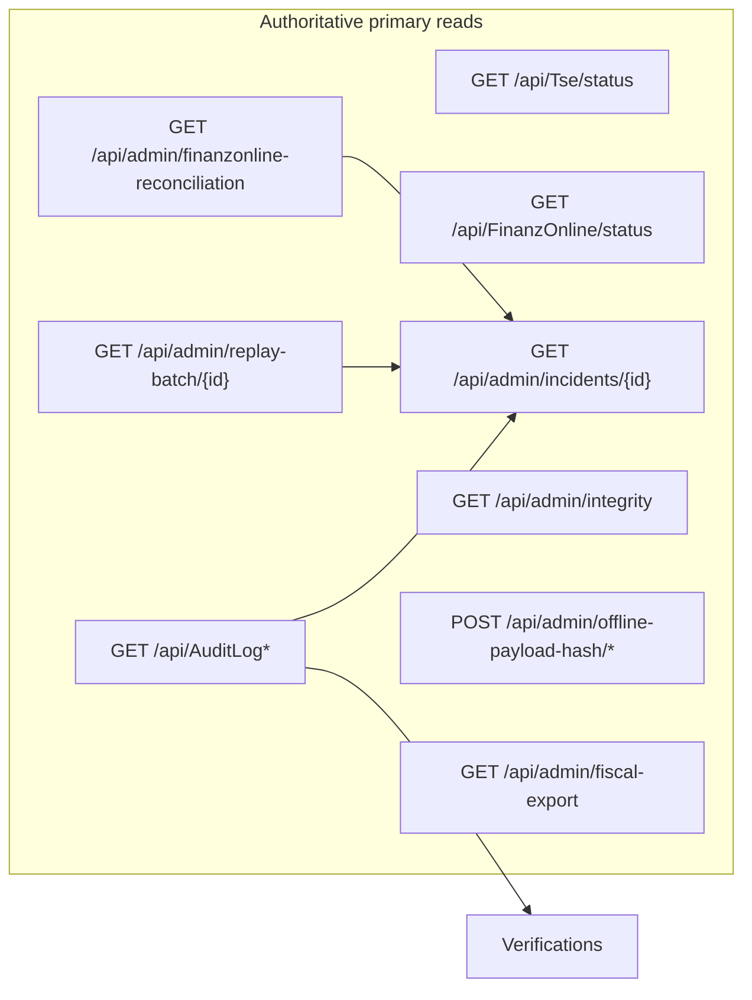

# RKSV admin — field-by-field truth matrix (truth-critical surfaces)

> **Status:** Historical/secondary RKSV matrix. Canonical baseline: `frontend-admin/docs/rksv-truth-matrix.md`.

**Purpose:** Review artifact mapping each listed admin surface to HTTP sources, Orval/generated types, and per-field truth classification.  
**Rules:** No new backend semantics invented here. **Authoritative** = value is taken directly from a named API field on the primary response for that widget. **Inferred** = frontend assumes shape or meaning without OpenAPI guarantee (structural typing, JSON parse, or undocumented backend behavior).  
**Facets:** Align with `OPERATOR_TRUTH_BADGE` kinds in `src/shared/operatorTruthCopy.ts` and register policy in `docs/CONTRACT_TRUTH_SURFACES.md` / `viewFinanzReconciliationRegister` / `viewReplayBatchTraceIds` in `src/shared/rksvAdminTruth.ts`.

**Legend**

| Class | Meaning |
|-------|---------|
| **A** | Authoritative API (primary DTO field for that row/widget) |
| **D** | Display-only / operator label (may be formatted time, currency) |
| **J** | Joined / composed in UI from another sub-object (e.g. FO row keyed by `paymentId`) |
| **C** | Client-derived filter or subset (not server-enforced semantics) |
| **B** | Best-effort / diagnostic / slice-scoped (explicitly not global legal or fiscal finality) |
| **I** | Inferred — local interface or untyped transport; not guaranteed by Orval |

---

## 1. General Status

**Route:** `/rksv/status` · `src/app/(protected)/rksv/status/page.tsx`

| # | Source endpoint(s) | Generated / transport type |
|---|-------------------|-----------------------------|
| 1 | `GET /api/Tse/status` | `TseStatusResponse` (`getApiTseStatus`) |
| 2 | `GET /api/FinanzOnline/status` | `FinanzOnlineStatusResponse` (`getApiFinanzOnlineStatus`) |

### Field matrix — TSE card

| UI / concept | API field | Class | Notes |
|--------------|-----------|-------|-------|
| Connection tag | `isConnected` | A | |
| Serial | `serialNumber` | A | nullable in OpenAPI |
| Kassen-ID | `kassenId` | A | display identifier; register FK policy for links is on other surfaces |
| Certificate | `certificateStatus` | A | |
| Can create invoices | `canCreateInvoices` | A | |
| Error banner | query `error` | D | React Query error, not a fiscal field |

### Field matrix — FinanzOnline card

| UI / concept | API field | Class | Notes |
|--------------|-----------|-------|-------|
| Connected tag | `isConnected` | A | Backend uses TSE-device-scoped check; **not** payment reconciliation (see `FINANZONLINE_ADMIN_SOURCE_OF_TRUTH.md`) |
| Pending invoices (label) | `pendingInvoices` | B | **Misleading if read as FO Abgleich queue** — TSE device counters, not `PaymentDetails` FO status |
| Last sync | `lastSync` | A | Same scope as status endpoint |
| Link „Open FinanzOnline Operations“ | — | D | Navigation only |

### Missing operational-truth fields

- No per-payment FO status, no reconciliation metrics, no link to Abgleich in primary card.

### Misleading or overclaimed copy

- **EN UI** on a de-DE operator surface: „Connected“, „Pending invoices“ without stating TSE vs payment reconciliation split.
- FO card implies single „Status“ for FinanzOnline readiness; reconciliation truth lives elsewhere.

### Investigation vs mutation

- **Read-only** (no mutations on page).

### OpenAPI vs frontend-only

| OpenAPI | Frontend-only |
|---------|----------------|
| Clarify descriptions on `FinanzOnlineStatusResponse` (`pendingInvoices` / `lastSync` semantics vs reconciliation). | Add Abgleich link + German copy clarifying non-reconciliation scope; align language policy. |

---

## 2. CMC / Certificate

**Route:** `/rksv/cmc-certificate` · `src/app/(protected)/rksv/cmc-certificate/page.tsx`

| # | Source endpoint(s) | Generated type(s) |
|---|-------------------|-------------------|
| 1 | `GET /api/Tse/status` | `TseStatusResponse` |
| 2 | `GET /api/Tse/devices` | `TseDevice[]` (`getApiTseDevices`) |

### Field matrix — Certificate Status card

| UI label | API field | Class | Notes |
|----------|-----------|-------|-------|
| Certificate Status | `certificateStatus` | A | from `TseStatusResponse` |
| Serial Number | `serialNumber` | A | |
| Kassen-ID | `kassenId` | A | |
| Memory Status | `memoryStatus` | A | |
| Last Signature Time | `lastSignatureTime` | A | |

### Field matrix — Available TSE Devices

| UI | API field | Class | Notes |
|----|-----------|-------|-------|
| Row label | `serialNumber` | D | Used as Descriptions label |
| Cell content | `kassenId` ?? `serialNumber` ?? `id` | A / D | **Client fallback chain** — first non-empty wins (**C** composition, not a single API „display“ field) |
| Device id | `id` | A | |

### Missing operational-truth fields

- No certificate expiry parsed, no RKSV-specific compliance statement, no mapping to active register row for deep links (`viewFinanzReconciliationRegister` not used here).

### Misleading or overclaimed copy

- English error/card copy („TSE data unavailable“, „No TSE devices detected“) vs German UI convention elsewhere.
- Device list cell mixes identifiers without badge for **display_only_label** vs authoritative FK.

### Investigation vs mutation

- **Read-only**.

### OpenAPI vs frontend-only

| OpenAPI | Frontend-only |
|---------|----------------|
| Optional: explicit `displayLabel` for device row if product wants stable semantics. | German copy; optional `AdminTruthBadge` on fallback chain. |

---

## 3. Verifications

**Route:** `/rksv/verifications` · `src/app/(protected)/rksv/verifications/page.tsx`

| # | Source endpoint(s) | Generated type(s) |
|---|-------------------|-------------------|
| 1 | `GET /api/AuditLog?page=&pageSize=` | `AuditLogsResponse` → `AuditLogEntryDto[]` |
| 2 | `GET /api/AuditLog/correlation/{correlationId}` | `AuditLogsResponse` (when query param set) |

### Field matrix — table columns (typical)

| Column / concept | API field | Class | Notes |
|------------------|-----------|-------|-------|
| Timestamp | `timestamp` | A | |
| User | `actorDisplayName` ?? `userId` | A | **Client fallback** |
| Action | `action` | A | free-form string in practice |
| Entity / correlation / etc. | various `AuditLogEntryDto` | A | per column |

### Client-derived subset

| Concept | Class | Notes |
|---------|-------|-------|
| „Signature-related“ filter | **C** | Keyword filter on `action` / `entityType` — **not** backed by OpenAPI enum; action renames **silently narrow** (documented in source comment) |
| Toggle filters (offline / failed replay / timing) | **C** | Same risk |

### Missing operational-truth fields

- No guarantee of completeness (pageSize 100 fixed in code).
- No server-side „verification result“ aggregate — list is raw audit projection.

### Misleading or overclaimed copy

- If operators treat filtered list as exhaustive „Verifications passed“ — **overclaim**; use `OPERATOR_VERIFICATIONS_COPY` / diagnostic_support framing.

### Investigation vs mutation

- **Read-only** on this page.

### OpenAPI vs frontend-only

| OpenAPI | Frontend-only |
|---------|----------------|
| Optional: enums or tags for replay/signature actions if stable contract desired. | Pagination control; stronger „diagnostic subset“ banner; keyword filter disclaimer already partially in code. |

---

## 4. FinanzOnline Operations (legacy)

**Route:** `/rksv/finanz-online-operations` · `src/app/(protected)/rksv/finanz-online-operations/page.tsx`  
**Ref:** `docs/FINANZONLINE_ADMIN_SOURCE_OF_TRUTH.md`

| # | Source endpoint(s) | Generated type(s) |
|---|-------------------|-------------------|
| 1 | `GET /api/FinanzOnline/status` | `FinanzOnlineStatusResponse` |
| 2 | `GET /api/FinanzOnline/config` | `FinanzOnlineConfigResponse` |
| 3 | `GET /api/FinanzOnline/errors` | `FinanzOnlineErrorResponse[]` |
| 4 | `GET /api/FinanzOnline/history/{invoiceId}` | `FinanzOnlineSubmission[]` |
| 5 | `POST /api/FinanzOnline/test-connection` | `FinanzOnlineTestResponse` |

### Field matrix — status card

| Field | Class | Notes |
|-------|-------|-------|
| `isConnected`, `apiVersion`, `lastSync`, `pendingInvoices`, `pendingReports`, `errorMessage` | A | Values are API-authored |
| Operational meaning vs payment FO | **B** | `pending*` / connection are **TSE/legacy simulation paths**, not reconciliation queue |

### Field matrix — config card

| Field | Class | Notes |
|-------|-------|-------|
| `isEnabled`, `autoSubmit`, `submitInterval`, `retryAttempts`, `apiUrl`, `username`, `enableValidation` | A | Snapshot from company + device flags |

### Field matrix — errors table

| Field | Class | Notes |
|-------|-------|-------|
| `code`, `message`, `timestamp`, `invoiceNumber`, `retryCount` | **I** | **Backend currently returns placeholder list** — fields are API-shaped but **not operational truth** |

### Field matrix — history table

| Field | Class | Notes |
|-------|-------|-------|
| `submittedAt`, `success`, `responseStatusCode`, `errorMessage`, etc. | A | From `FinanzOnlineSubmission` entity |
| Coverage vs current checkout FO | **B** | May **not** reflect `PaymentDetails` FO state |

### Field matrix — test connection result

| Field | Class | Notes |
|-------|-------|-------|
| `success`, `message`, `responseTime`, `timestamp`, `apiVersion` | A | **Simulated** path in backend — diagnostic, not production FO outcome per payment |

### Missing operational-truth fields

- Payment-scoped FO status, `paymentId`, reconciliation reference ids (use Abgleich API).

### Misleading or overclaimed copy

- „Recent Errors“ title suggests live ops feed — **overclaim** while backend is placeholder.
- „Pending Invoices“ **equated** with FO backlog — **misleading** vs Abgleich.

### Investigation vs mutation

- **Mixed:** reads + **mutation** `POST …/test-connection` (diagnostic only).

### OpenAPI vs frontend-only

| OpenAPI | Frontend-only |
|---------|----------------|
| Deprecate or document `errors`; document `history` vs payment pipeline; `FinanzOnlineStatusResponse` semantics. | Badges: `diagnostic_support`; rename cards (see FINANZONLINE doc). |

---

## 5. FinanzOnline Reconciliation / Abgleich

**Route:** `/rksv/finanz-online-queue` · `src/app/(protected)/rksv/finanz-online-queue/page.tsx`

| # | Source endpoint(s) | Generated type(s) |
|---|-------------------|-------------------|
| 1 | `GET /api/admin/finanzonline-reconciliation` | `FinanzOnlineReconciliationListResponse`, `FinanzOnlineReconciliationItemDto` |
| 2 | `GET /api/admin/finanzonline-reconciliation/metrics` | `FinanzOnlineMetricsResponse` |
| 3 | `POST /api/admin/finanzonline-reconciliation/retry/{paymentId}` | `FinanzOnlineRetryResponse` |
| 4 | `GET /api/CashRegister` (via `getAdminCashRegisters`) | Normalized `CashRegisterRow[]` (**I** adapter) |

### Field matrix — list row (`FinanzOnlineReconciliationItemDto`)

| Field | Class | Notes |
|-------|-------|-------|
| `paymentId` | A | Retry and investigation key |
| `receiptNumber` | A | Display + correlation |
| `createdAt` | A | |
| `totalAmount` | A | |
| `cashRegisterId` | A | Register FK; use `viewFinanzReconciliationRegister` for link-safe UUID (**A** + policy) |
| `finanzOnlineStatus` | A | |
| `finanzOnlineError` | A | |
| `finanzOnlineReferenceId` | A | |
| `finanzOnlineLastAttemptAtUtc` | A | |
| `finanzOnlineRetryCount` | A | |
| Register display label (human) | — | **Missing in DTO** — gap in `RKSv_ADMIN_CONTRACT_GAPS.finanzReconciliationRegisterDisplay` |

### Field matrix — metrics

| Field | Class | Notes |
|-------|-------|-------|
| `submitTotal`, `submitFailed*` | A | **Volatile process counters** (restart) — **B** for long-term truth |

### URL query params (`cashRegisterId`, `status`, `fromUtc`, `toUtc`, investigation context)

| Param | Class | Notes |
|-------|-------|-------|
| `cashRegisterId` | A | Only applied when `parseAuthoritativeRegisterGuid` accepts — else rejected banner (**A** policy, honest UI) |
| `focusPaymentId` | **C** | Row highlight only, not server filter |
| `investigationBatchCorrelationId` | **C** | Context-only (documented in `OPERATOR_INVESTIGATION_CONTEXT_COPY`) |

### Missing operational-truth fields

- Optional `invoiceId` on row (cross-navigation without inferring) — OpenAPI gap suggestion only.
- Register display label (see gaps).

### Misleading or overclaimed copy

- Retry button visibility **≠** backend terminality — mitigated by `OPERATOR_FO_RETRY_UI_COPY` / tooltips if used consistently.

### Investigation vs mutation

- **Mixed:** list read + **retry** mutation.

### OpenAPI vs frontend-only

| OpenAPI | Frontend-only |
|---------|----------------|
| Optional register label; optional `invoiceId`; document metrics volatility. | Already uses `viewFinanzReconciliationRegister`, investigation hrefs. |

---

## 6. Fiscal Export Diagnose

**Route:** `/rksv/fiscal-export-diagnostics` · `src/app/(protected)/rksv/fiscal-export-diagnostics/page.tsx`

| # | Source endpoint(s) | Type situation |
|---|-------------------|----------------|
| 1 | `GET /api/admin/fiscal-export?format=json&…` | Orval `getApiAdminFiscalExport` returns **`void`** — **contract defect** |
| 2 | Same URL via `getFiscalExportPreview` in `src/api/admin-rksv/client.ts` | Response = **I** (`axios` `.data` unconstrained) |
| 3 | Page-local `FiscalExportPackage` / `FiscalExportIntegrity` | **I** — structural assumption of JSON shape |
| 4 | `GET /api/CashRegister` (picker) | Via `getAdminCashRegisters` → **I** normalized rows |

### Field matrix — preview / summary (representative)

| Concept | Class | Notes |
|---------|-------|-------|
| `receiptCount`, `closingCount`, `receiptsTruncated`, `totalReceiptsMatchingPeriod` | **I** | Treated as authoritative **if** backend matches assumed shape |
| `notLegalProofNotice` | **I** | Critical honesty field when present |
| `exportScopeWarnings`, `chainContinuityWarnings` | **I** | |
| `integrity.*` (chain, offline coverage, hash mismatch ratio, …) | **I** / **B** | **Slice-scoped** export integrity; page Alert points to Datenintegrität for DB-wide checks |

### Missing operational-truth fields

- Orval-typed fiscal export response (single schema for JSON body).

### Misleading or overclaimed copy

- Without prominent notice, JSON fields could be read as legal proof — mitigated when `notLegalProofNotice` present; ensure always visible when backend sends.

### Investigation vs mutation

- **Read-only** (preview + download); download uses blob path with error-envelope detection.

### OpenAPI vs frontend-only

| OpenAPI | Frontend-only |
|---------|----------------|
| **Required:** define fiscal export JSON schema; fix `getApiAdminFiscalExport` return type (replace `void`). | Until then: keep **I** documentation; optional runtime validator (zod) **only** if product accepts — would be new dep/discipline. |

---

## 7. Datenintegrität (Support)

**Route:** `/rksv/integrity` · `src/app/(protected)/rksv/integrity/page.tsx`

| # | Source endpoint(s) | Generated type(s) |
|---|-------------------|-------------------|
| 1 | `GET /api/admin/integrity` | `IntegrityReportDto` |

### Field matrix — `IntegrityReportDto`

| Field | Class | Notes |
|-------|-------|-------|
| `generatedAtUtc` | A | |
| `sequenceIssues` → `duplicateReceiptNumberCount`, `nonMonotonicSequenceCount`, `duplicateReceiptNumbers`, `nonMonotonicKeys` | A | Details gated by `includeDetails` query param |
| `orphanRefunds` → counts / id lists | A | |
| `paymentWithoutInvoice` → `count`, `paymentIds` | A | |

### Client adjustment

| Concept | Class | Notes |
|---------|-------|-------|
| Date range inclusive end | **C** | UI sends `toDate` as day+1 — **documented in file comment**; backend rule is exclusive upper bound |

### Missing operational-truth fields

- Explicit per-issue severity from backend beyond counts (UI uses local thresholds for tags).

### Misleading or overclaimed copy

- Alert states „kein Rechtsnachweis“ — good. Tag „OK“ from **client** count thresholds — **B**, not API guarantee.

### Investigation vs mutation

- **Read-only**.

### OpenAPI vs frontend-only

| OpenAPI | Frontend-only |
|---------|----------------|
| Optional: severity or recommended action per section. | Remove redundant `as IntegrityReportDto` if query typing sufficient; keep threshold tags labeled as UI heuristic. |

---

## 8. Replay Batch Detail

**Route:** `/rksv/replay-batch/[correlationId]` · `src/app/(protected)/rksv/replay-batch/[correlationId]/page.tsx`

| # | Source endpoint(s) | Generated type(s) |
|---|-------------------|-------------------|
| 1 | `GET /api/admin/replay-batch/{correlationId}` | `ReplayBatchDetailResponse` |

### Field matrix — `ReplayBatchDetailResponse`

| Field | Class | Notes |
|-------|-------|-------|
| `correlationId` | A | Batch correlation |
| `auditCorrelationId` | A | May differ; drives Verifications link via `viewReplayBatchTraceIds(..., { verificationsAuditOnly: true })` |
| `totalItems`, `successCount`, `failedOrDuplicateCount` | A | |
| `coverageSampleCount` | A | **B** — observability sample, footnoted |
| `offlineSyncedAuditCount` | A | **B** — audit label count |
| `offlineFinalFailureAuditCount` | A | **B** — not automatic „finality“ (see `OPERATOR_REPLAY_COPY`) |
| `payments[]` → `ReplayBatchPaymentItemDto` | A | |

### Field matrix — `ReplayBatchPaymentItemDto`

| Field | Class | Notes |
|-------|-------|-------|
| `paymentId`, `receiptId`, `receiptNumber`, `offlineTransactionId`, `totalAmount`, `createdAtUtc` | A | |
| FO status / correlation per payment | **Missing** | Documented in UI: no FO fields on DTO — use Incident / Abgleich |

### Derived / navigation

| Concept | Class | Notes |
|---------|-------|-------|
| Incident / Verifications / FO queue links | **D** + **C** | `buildIncidentInvestigationHref`, `buildVerificationsAuditHref`, `buildFinanzOnlineQueueInvestigationHref` — **separate data sources** (`OPERATOR_REPLAY_COPY.investigationPathIntro`) |

### Missing operational-truth fields

- Per-payment success/fail, FO columns on batch payment row (OpenAPI gap noted in `RKSv_ADMIN_CONTRACT_GAPS.replayBatchPaymentRegisterFk` / incident copy).

### Misleading or overclaimed copy

- „Immutable Success-Audit Events“ subtitle under OFFLINE_SYNCED — ensure read with audit-label **B** semantics (footnote present).

### Investigation vs mutation

- **Read-only**.

### OpenAPI vs frontend-only

| OpenAPI | Frontend-only |
|---------|----------------|
| Extend `ReplayBatchPaymentItemDto` if product needs FO/register on batch row. | Already uses `viewReplayBatchTraceIds`, badges, gap Alert. |

---

## 9. Incident

**Route:** `/rksv/incident` · `src/app/(protected)/rksv/incident/page.tsx`

| # | Source endpoint(s) | Generated type(s) |
|---|-------------------|-------------------|
| 1 | `GET /api/admin/incidents/{correlationId}` | `IncidentInvestigationResponse` |

### Field matrix — aggregate

| Sub-object | Class | Notes |
|------------|-------|-------|
| `replayBatch` | A | Same `ReplayBatchDetailResponse` semantics as §8 |
| `auditLogs[]` | A | `AuditLogEntryDto` |
| `finanzOnlineReconciliation[]` | A | `FinanzOnlineReconciliationItemDto` rows for correlated payments |
| `hints` | A | `IncidentInvestigationHintsDto` |

### Field matrix — `IncidentInvestigationHintsDto`

| Field | Class | Notes |
|-------|-------|-------|
| `finanzOnlineSubmittedCount`, `finanzOnlineOpenOrProblemCount` | A | **J**/**B** — aggregate over included FO rows; **not** row-granular truth (`OPERATOR_INCIDENT_COPY.foAggregateLine`) |
| `hasLockTimeoutAudit`, `hasPayloadImmutableMismatchAudit` | A | Derived on server from audit scan |

### Joined FO column on payment table

| Concept | Class | Notes |
|---------|-------|-------|
| FO status cell | **J** | Map `paymentId` → `finanzOnlineReconciliation` row; badge **derived_from_foreign_row** |

### Inferred (documented in code)

| Concept | Class | Notes |
|---------|-------|-------|
| `replayPath`, `payloadRepaired` in timeline | **I** | Parsed from `requestData` / `responseData` JSON via `parseReplayMeta` — **not** typed DTO fields |

### Missing operational-truth fields

- Typed replay metadata on `AuditLogEntryDto` instead of JSON blob parse.

### Misleading or overclaimed copy

- FO aggregate counts must not be read as „all FO in system“ — copy mitigated if `OPERATOR_INCIDENT_COPY` used.

### Investigation vs mutation

- **Read-only**.

### OpenAPI vs frontend-only

| OpenAPI | Frontend-only |
|---------|----------------|
| Optional structured fields on audit entries for replay meta. | Keep `parseReplayMeta` strict (no silent success on malformed JSON). |

---

## 10. Payload Hash Konflikte

**Route:** `/rksv/payload-hash-conflicts` · `src/app/(protected)/rksv/payload-hash-conflicts/page.tsx`  
**Note:** File header comment says „read-only“ / „no repair“ but the page implements **dry-run and apply repair** — treat as **mixed** (doc drift).

| # | Source endpoint(s) | Generated type(s) |
|---|-------------------|-------------------|
| 1 | `POST /api/admin/offline-payload-hash/analyze` | `OfflinePayloadHashAnalyzeResult` |
| 2 | `POST /api/admin/offline-payload-hash/repair` | `OfflinePayloadHashRepairResult` |
| 3 | `GET /api/admin/offline-payload-hash/export` | `Blob` (**I** — manual client in `admin-rksv/client.ts`) |
| 4 | `GET /api/CashRegister` (picker) | `getAdminCashRegisters` (**I** adapter) |

### Field matrix — analyze result

| Field | Class | Notes |
|-------|-------|-------|
| `scanned`, `runtimeMismatchCount`, `nullOrEmptyPayloadHash`, `skippedWouldConflictCount`, `repairableNoConflictCount` | A | |
| `mismatchRatioPercent`, `legacyDataQualityRiskHigh` | A | |
| `conflictGroups[]` | A | See `PayloadHashConflictGroup` |
| `repairableItems[]` | A | `PayloadHashRepairableItem` |
| `sampleMismatchIds`, `warningMessage` | A | |

### Field matrix — `PayloadHashConflictGroup` (table)

| Field | Class | Notes |
|-------|-------|-------|
| `cashRegisterId`, `canonicalHash`, `skipReason`, `severitySuggestion`, `latestCreatedAtUtc`, `mismatchRowIds`, `occupantRowIds` | A | UI may truncate display (**D**) |

### Field matrix — repair result

| Field | Class | Notes |
|-------|-------|-------|
| `dryRun`, `updated`, `scanned`, `skipped*` | A | |

### Missing operational-truth fields

- Post-repair verification endpoint (if product wants automated re-check) — **not** asserting requirement here.

### Misleading or overclaimed copy

- Top-of-file comment vs actual repair actions — **misleading for maintainers**; operators need clear **mutation** warnings and permission gate (`SYSTEM_CRITICAL` for repair).

### Investigation vs mutation

- **Mixed:** analyze (read-like POST) + repair mutations + CSV export.

### OpenAPI vs frontend-only

| OpenAPI | Frontend-only |
|---------|----------------|
| Ensure analyze/repair/export fully described. | Fix file header comment; confirm German strings for destructive actions. |

---

## Cross-surface dependency map (quick)

---

## References

- `docs/CONTRACT_TRUTH_SURFACES.md`
- `docs/FINANZONLINE_ADMIN_SOURCE_OF_TRUTH.md`
- `src/shared/rksvAdminTruth.ts` — `RKSv_ADMIN_CONTRACT_GAPS`, `viewReplayBatchTraceIds`, `viewFinanzReconciliationRegister`
- `src/shared/adminTruthFacets.ts`, `src/shared/operatorTruthCopy.ts`
